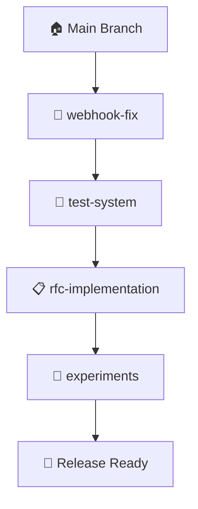

# 🔗 Estratégia de Integração dos Worktrees

## 🎯 Princípio: "Do Mais Crítico ao Menos Crítico"

### 📊 **Ordem de Integração (SEMPRE nesta sequência)**



## 1️⃣ **PRIMEIRO: Bug Fixes Críticos**
```bash
# webhook-fix (bug do enum 0)
# Por quê primeiro? Corrige problema em produção
```

**Motivo**: Bug crítico afeta usuários reais NOW.

## 2️⃣ **SEGUNDO: Sistema de Testes**
```bash
# test-system (626 eventos, anonimização)
# Por quê segundo? Valida se webhook-fix funcionou
```

**Motivo**: Testes garantem que o bug foi realmente corrigido.

## 3️⃣ **TERCEIRO: Novas Funcionalidades**
```bash
# rfc-implementation (novos endpoints)
# Por quê terceiro? Adiciona valor sem quebrar o existente
```

**Motivo**: Features novas só depois de garantir estabilidade.

## 4️⃣ **QUARTO: Experimentos**
```bash
# experiments (CodeLoops, Task Master)
# Por quê último? Pode ou não entrar na release
```

**Motivo**: Experimental, pode ser deixado para próxima versão.

---

## 🛡️ **Processo Seguro de Integração**

### **Antes de Qualquer Merge:**
```bash
# 1. Atualizar main
cd ~/code/projetos/n8n-hotmart
git pull origin master

# 2. Testar isoladamente cada worktree
cd ~/code/projetos/n8n-hotmart-webhook-fix
npm test  # Deve passar 100%

cd ~/code/projetos/n8n-hotmart-test-system  
npm test  # Deve passar 100%
```

### **Durante o Merge:**
```bash
# 3. Integração com backup automático
cd ~/code/projetos/n8n-hotmart
./scripts/merge-worktrees.sh
# Escolha: 1 (Integração completa)
```

### **O que o script faz automaticamente:**
1. ✅ **Backup** da main antes de cada merge
2. ✅ **Merge** com --no-ff (preserva histórico)
3. ✅ **Testa** após cada integração
4. ✅ **Reverte** se algum teste falhar
5. ✅ **Limpa** backups se tudo der certo

---

## 🔥 **Cenários Comuns**

### **Cenário A: Tudo Funciona Perfeitamente**
```bash
$ ./scripts/merge-worktrees.sh
🔗 Integrando webhook-fix... ✅
🔗 Integrando test-system... ✅  
🔗 Integrando rfc-implementation... ✅
🎉 SUCESSO TOTAL!
```

### **Cenário B: Conflito no Meio**
```bash
$ ./scripts/merge-worktrees.sh
🔗 Integrando webhook-fix... ✅
🔗 Integrando test-system... ❌ CONFLITO!
🔄 Revertendo para estado seguro...
📋 Manual: Resolva conflitos em test-system
```

**Como resolver:**
```bash
# 1. Ir para o worktree problemático
cd ~/code/projetos/n8n-hotmart-test-system

# 2. Atualizar com main
git fetch ../n8n-hotmart master
git merge master  # Resolver conflitos manualmente

# 3. Tentar integração novamente
cd ~/code/projetos/n8n-hotmart
./scripts/merge-worktrees.sh
```

### **Cenário C: Teste Falha Após Merge**
```bash
$ ./scripts/merge-worktrees.sh
🔗 Integrando webhook-fix... ✅
🔗 Integrando test-system... ✅
🔗 Integrando rfc-implementation... ❌ TESTE FALHOU!
🔄 Revertendo automaticamente...
```

**Estado final**: Main volta exatamente como estava antes.

---

## 🎯 **Workflow Completo de Integração**

### **Semana Típica:**

#### **Segunda a Quinta: Desenvolvimento**
```bash
# Cada pessoa/contexto trabalha isoladamente
cd n8n-hotmart-webhook-fix    # Correções
cd n8n-hotmart-test-system    # Testes  
cd n8n-hotmart-rfc-implementation  # Features
```

#### **Sexta: Dia de Integração**
```bash
# 1. Preparação (10 min)
# Cada worktree commita mudanças finais
# Todos os testes passando isoladamente

# 2. Integração Automática (20 min)
cd ~/code/projetos/n8n-hotmart
./scripts/merge-worktrees.sh

# 3. Validação Final (30 min)
npm run build
npm test
npm run lint

# 4. Release (5 min)
git tag v1.2.3
git push origin master --tags
```

---

## 🚨 **Regras de Ouro**

### ❌ **NUNCA faça:**
- Merge direto sem teste
- Integração fora de ordem
- Force push na main
- Merge com testes falhando

### ✅ **SEMPRE faça:**
- Teste isolado antes de integrar
- Backup automático (script faz isso)
- Resolva conflitos nos worktrees, não na main
- Mantenha main sempre deployável

---

## 📊 **Resultado Final**

Após integração completa, você terá:

```bash
n8n-hotmart/  # MAIN com tudo integrado
├── 🐛 Bug do enum 0 corrigido
├── 🧪 Sistema de testes funcionando
├── 📋 Novos endpoints implementados
├── 🔬 Experimentos (se estáveis)
└── 🚀 Pronto para produção
```

### **Limpeza Final:**
```bash
# Remover worktrees não necessários
git worktree remove ../n8n-hotmart-webhook-fix
git worktree remove ../n8n-hotmart-test-system
# (manter experiments para futuras iterações)

# Limpar branches integradas
git branch -d webhook-fix
git branch -d test-system
```

---

## 💡 **Pro Tips**

1. **Sempre teste isoladamente primeiro**
2. **Use o script - ele é mais seguro que manual**
3. **Mantenha experiments separado até ter certeza**
4. **Faça integração em horário que pode resolver problemas**
5. **Comunique com equipe antes de integrar**

**O script cuida da parte técnica, você foca na estratégia! 🚀**