# Plano de Integração Hotmart com n8n

Este documento apresenta o plano detalhado para desenvolvimento da integração entre a API Hotmart e o n8n, permitindo a criação de fluxos de automação envolvendo produtos, vendas, assinaturas e outros recursos da plataforma Hotmart.

## Índice

1. [Visão Geral](#visão-geral)
2. [Diagrama de Arquitetura](#diagrama-de-arquitetura)
3. [Estrutura de Diretórios](#estrutura-de-diretórios)
4. [Implementação de Autenticação OAuth2](#implementação-de-autenticação-oauth2)
5. [Sistema de Paginação](#sistema-de-paginação)
6. [Recursos e Operações](#recursos-e-operações)
7. [Considerações de Implementação](#considerações-de-implementação)
8. [Próximos Passos](#próximos-passos)

## Visão Geral

A integração n8n-hotmart fornecerá nós personalizados para interação com a API Hotmart, permitindo acesso programático a:

- Dados de vendas e comissões
- Gerenciamento de assinaturas
- Informações de produtos
- Gestão de cupons
- Dados da área de membros (Club)
- Informações de eventos e tickets

A implementação seguirá as melhores práticas de desenvolvimento de nós para n8n, usando TypeScript e uma arquitetura modular que facilita manutenção e extensão.

## Diagrama de Arquitetura

```mermaid
graph TD
    A[Hotmart.node.ts] --> B[HotmartV1.node.ts]
    B --> C[router.ts]
    C --> D1[Club]
    C --> D2[Coupon]
    C --> D3[Product]
    C --> D4[Sales]
    C --> D5[Subscription]
    C --> D6[Ticket]
    
    D1 --> E1[getStudents.operation.ts]
    D1 --> E2[getModules.operation.ts]
    D1 --> E3[getProgress.operation.ts]
    D1 --> E4[getPages.operation.ts]
    
    D2 --> F1[create.operation.ts]
    D2 --> F2[delete.operation.ts]
    D2 --> F3[get.operation.ts]
    
    D3 --> G1[getProducts.operation.ts]
    
    D4 --> H1[getHistory.operation.ts]
    D4 --> H2[getParticipants.operation.ts]
    D4 --> H3[getCommissions.operation.ts]
    D4 --> H4[getPriceDetails.operation.ts]
    D4 --> H5[getRefunds.operation.ts]
    D4 --> H6[getSummary.operation.ts]
    
    D5 --> I1[changeBillingDate.operation.ts]
    D5 --> I2[cancel.operation.ts]
    D5 --> I3[cancelList.operation.ts]
    D5 --> I4[getAll.operation.ts]
    D5 --> I5[getPurchases.operation.ts]
    D5 --> I6[reactivate.operation.ts]
    D5 --> I7[getSummary.operation.ts]
    
    D6 --> J1[getEventInfo.operation.ts]
    D6 --> J2[getTickets.operation.ts]
    
    B --> K[transport/request.ts]
    B --> L[methods/loadOptions.ts]
```



## Estrutura de Diretórios

```
n8n-nodes-hotmart/
├── credentials/
│   └── HotmartOAuth2Api.credentials.ts
├── nodes/
│   ├── Hotmart/
│   │   ├── Hotmart.node.json
│   │   ├── Hotmart.node.ts
│   │   ├── hotmart.svg
│   │   ├── v1/
│   │   │   ├── HotmartV1.node.ts
│   │   │   ├── actions/
│   │   │   │   ├── router.ts
│   │   │   │   ├── versionDescription.ts
│   │   │   │   ├── common.descriptions.ts
│   │   │   │   ├── node.type.ts
│   │   │   │   ├── club/
│   │   │   │   ├── coupon/
│   │   │   │   ├── product/
│   │   │   │   ├── sales/
│   │   │   │   ├── subscription/
│   │   │   │   └── ticket/
│   │   │   ├── methods/
│   │   │   │   └── loadOptions.ts
│   │   │   ├── transport/
│   │   │   │   └── request.ts
│   │   │   ├── helpers/
│   │   │   │   └── pagination.ts
```

## Implementação de Autenticação OAuth2

### Arquivo de Credenciais

```typescript
// HotmartOAuth2Api.credentials.ts
import {
  IAuthenticateGeneric,
  ICredentialTestRequest,
  ICredentialType,
  INodeProperties,
} from 'n8n-workflow';

export class HotmartOAuth2Api implements ICredentialType {
  name = 'hotmartOAuth2Api';
  displayName = 'Hotmart OAuth2 API';
  documentationUrl = 'https://developers.hotmart.com/docs/pt-BR/start/app-auth';
  
  // Define se é ambiente de produção ou sandbox
  properties: INodeProperties[] = [
    {
      displayName: 'Environment',
      name: 'environment',
      type: 'options',
      options: [
        {
          name: 'Production',
          value: 'production',
        },
        {
          name: 'Sandbox',
          value: 'sandbox',
        },
      ],
      default: 'production',
    },
    {
      displayName: 'Client ID',
      name: 'clientId',
      type: 'string',
      default: '',
    },
    {
      displayName: 'Client Secret',
      name: 'clientSecret',
      type: 'string',
      typeOptions: {
        password: true,
      },
      default: '',
    },
    {
      displayName: 'Basic Token',
      name: 'basicToken',
      type: 'string',
      typeOptions: {
        password: true,
      },
      default: '',
      description: 'Token básico fornecido pela Hotmart ao criar credenciais',
    },
  ];

  // Como usar as credenciais para as requisições
  authenticate: IAuthenticateGeneric = {
    type: 'generic',
    properties: {
      headers: {
        Authorization: '={{`Bearer ${$credentials.accessToken}`}}',
      },
    },
  };

  // Método para testar a validade das credenciais
  test: ICredentialTestRequest = {
    request: {
      baseURL: '={{$credentials.environment === "production" ? "https://developers.hotmart.com" : "https://sandbox.hotmart.com"}}',
      url: '/payments/api/v1/sales/history?max_results=1',
      method: 'GET',
    },
  };
}
```

### Função para Obter/Renovar o Token de Acesso

```typescript
// transport/request.ts
import { IExecuteFunctions, IHttpRequestOptions } from 'n8n-workflow';

export async function hotmartApiRequest(
  this: IExecuteFunctions,
  method: string,
  endpoint: string,
  body: any = {},
  query: object = {},
): Promise<any> {
  const credentials = await this.getCredentials('hotmartOAuth2Api');
  const baseUrl = credentials.environment === 'production' 
    ? 'https://developers.hotmart.com'
    : 'https://sandbox.hotmart.com';

  const options: IHttpRequestOptions = {
    method,
    body,
    url: `${baseUrl}${endpoint}`,
    qs: query,
  };

  try {
    // Tenta fazer a requisição com token atual
    return await this.helpers.httpRequestWithAuthentication.call(
      this,
      'hotmartOAuth2Api',
      options,
    );
  } catch (error) {
    // Se for erro 401 (token expirado), obtenha um novo token e tente novamente
    if (error.response?.statusCode === 401) {
      await refreshToken.call(this);
      return await this.helpers.httpRequestWithAuthentication.call(
        this,
        'hotmartOAuth2Api',
        options,
      );
    }
    throw error;
  }
}

async function refreshToken(this: IExecuteFunctions) {
  const credentials = await this.getCredentials('hotmartOAuth2Api');
  const { clientId, clientSecret, basicToken } = credentials;
  
  const tokenUrl = credentials.environment === 'production'
    ? 'https://api-sec-vlc.hotmart.com/security/oauth/token'
    : 'https://api-sec-vlc.hotmart.com/security/oauth/token';  // URL de sandbox
  
  const options: IHttpRequestOptions = {
    method: 'POST',
    url: tokenUrl,
    headers: {
      'Content-Type': 'application/json',
      'Authorization': `Basic ${basicToken}`,
    },
    qs: {
      grant_type: 'client_credentials',
      client_id: clientId,
      client_secret: clientSecret,
    },
  };

  const response = await this.helpers.httpRequest(options);
  
  // Atualiza as credenciais com o novo token
  await this.helpers.updateCredentials(
    credentials.id as string,
    {
      accessToken: response.access_token,
      expires: Date.now() + response.expires_in * 1000,
    }
  );
  
  return response;
}
```

## Sistema de Paginação

A API Hotmart utiliza paginação baseada em cursor. Para implementar um parâmetro "Retornar Todos os Resultados" que automaticamente recupera todas as páginas, criaremos:

### Parâmetros de Paginação na UI

```typescript
// Em qualquer arquivo de operação que lista recursos
export const description: INodeProperties[] = [
  // ... outros parâmetros da operação
  {
    displayName: 'Retornar Todos os Resultados',
    name: 'returnAll',
    type: 'boolean',
    default: false,
    description: 'Se ativado, buscará automaticamente todos os registros em todas as páginas',
  },
  {
    displayName: 'Máximo de Resultados',
    name: 'limit',
    type: 'number',
    default: 50,
    description: 'Número máximo de resultados a serem retornados',
    typeOptions: {
      minValue: 1,
    },
    displayOptions: {
      show: {
        returnAll: [false],
      },
    },
  },
  {
    displayName: 'Resultados Por Página',
    name: 'maxResults',
    type: 'number',
    default: 50,
    description: 'Quantos resultados buscar por requisição',
    typeOptions: {
      minValue: 1,
      maxValue: 100,
    },
  },
];
```

### Helper de Paginação

```typescript
// helpers/pagination.ts
export async function getAllItems(
  this: IExecuteFunctions,
  options: PaginationOptions,
): Promise<any[]> {
  const { maxResults, resource, operation, query = {}, body = {} } = options;
  
  const returnData: IDataObject[] = [];
  let responseData: IDataObject;
  let nextPageToken: string | undefined;
  
  // Implementar controle de rate limit
  const rateLimitDelay = 100; // ms entre requisições
  
  do {
    // Configurar a consulta com o token da página
    const endpoint = getEndpointForResourceOperation(resource, operation);
    const queryParams = {
      ...query,
      max_results: maxResults,
      ...(nextPageToken && { page_token: nextPageToken }),
    };
    
    // Fazer requisição para esta página
    responseData = await hotmartApiRequest.call(
      this,
      'GET',
      endpoint,
      body,
      queryParams,
    );
    
    // Se houver itens, adicionar ao array de retorno
    if (responseData.items && Array.isArray(responseData.items)) {
      returnData.push(...responseData.items);
    }
    
    // Extrair o token da próxima página (se existir)
    nextPageToken = responseData.page_info?.next_page_token;
    
    // Para evitar atingir rate limits, adicionar um pequeno atraso
    if (nextPageToken) {
      await new Promise(resolve => setTimeout(resolve, rateLimitDelay));
    }
    
  } while (nextPageToken);
  
  return returnData;
}
```

### Uso na Operação

```typescript
// actions/sales/getHistory.operation.ts
export const execute = async function (
  this: IExecuteFunctions,
  items: INodeExecutionData[],
): Promise<INodeExecutionData[]> {
  const returnData: INodeExecutionData[] = [];
  
  for (let i = 0; i < items.length; i++) {
    const returnAll = this.getNodeParameter('returnAll', i, false);
    const maxResults = this.getNodeParameter('maxResults', i, 50);
    // ... outros parâmetros
    
    let responseData;
    
    if (returnAll) {
      // Usar helper para obter todos os itens
      responseData = await getAllItems.call(
        this,
        {
          maxResults,
          resource: 'sales',
          operation: 'getHistory',
          query: queryParams,
        },
      );
    } else {
      // Obter apenas uma página
      const limit = this.getNodeParameter('limit', i, 50);
      queryParams.max_results = limit;
      
      const response = await hotmartApiRequest.call(
        this,
        'GET',
        '/payments/api/v1/sales/history',
        {},
        queryParams,
      );
      
      responseData = response.items || [];
    }
    
    // Processar e retornar os dados
    const executionData = this.helpers.constructExecutionMetaData(
      this.helpers.returnJsonArray(responseData),
      { itemData: { item: i } },
    );
    
    returnData.push(...executionData);
  }
  
  return returnData;
};
```

## Recursos e Operações

### 1. Club (Área de Membros)

- **Obter Alunos**: Lista estudantes de um produto
- **Obter Módulos**: Retorna todos os módulos de um produto
- **Obter Progresso**: Obtém o progresso de um aluno
- **Obter Páginas**: Lista as páginas de conteúdo de um módulo

### 2. Cupons

- **Criar Cupom**: Cria um novo cupom de desconto
- **Excluir Cupom**: Remove um cupom existente
- **Obter Cupom**: Retorna detalhes de um cupom específico

### 3. Produtos

- **Obter Produtos**: Lista os produtos do produtor

### 4. Vendas

- **Histórico de Vendas**: Lista vendas realizadas
- **Participantes de Vendas**: Obtém participantes de uma venda
- **Comissões de Vendas**: Retorna informações de comissões
- **Detalhamento de Preços**: Detalha os valores de uma venda
- **Reembolso de Vendas**: Informações sobre reembolsos
- **Sumário de Vendas**: Dados sumarizados de vendas

### 5. Assinaturas

- **Alterar Dia de Cobrança**: Modifica a data de cobrança
- **Cancelar Assinatura(s)**: Cancela assinaturas
- **Obter Assinaturas**: Lista assinaturas existentes
- **Obter Compras de Assinantes**: Retorna compras de um assinante
- **Reativar e Cobrar Assinatura(s)**: Reativa assinaturas
- **Sumário de Assinaturas**: Dados sumarizados

### 6. Tickets

- **Informações do Evento**: Detalhes de um evento
- **Lista de Ingressos**: Ingressos e participantes

## Considerações de Implementação

1. **Suporte a Sandbox**: Toda a integração deve suportar tanto o ambiente de produção quanto o sandbox para testes.

2. **Versionamento**: A estrutura do projeto suporta versionamento para futuras evoluções da API.

3. **Manipulação de Erros**: Implementar tratamentos específicos para erros comuns da API Hotmart.

4. **Rate Limits**: Implementar controles para respeitar os limites de taxa da API.

5. **Carregamento Dinâmico de Opções**: Para facilitar a experiência do usuário com seleção de produtos, módulos, etc.

6. **Paginação Eficiente**: Para conjuntos grandes de dados, conforme detalhado na seção de paginação.

## Próximos Passos

1. **Setup Inicial**
   - Configurar a estrutura básica do projeto
   - Implementar o arquivo package.json com as dependências corretas

2. **Desenvolvimento da Autenticação**
   - Implementar o módulo de credenciais OAuth2
   - Criar o sistema de refresh token

3. **Implementação do Core**
   - Desenvolver a estrutura base dos nós (Hotmart.node.ts, HotmartV1.node.ts)
   - Criar o roteador de operações

4. **Implementação dos Recursos**
   - Desenvolver cada recurso e suas operações, priorizando:
     1. Vendas (informações cruciais para negócios)
     2. Assinaturas (gestão de clientes recorrentes)
     3. Cupons (marketing e promoções)
     4. Produtos (informações de catálogo)
     5. Club (conteúdo e progresso)
     6. Tickets (eventos)

5. **Testes e Documentação**
   - Testar cada operação no ambiente sandbox
   - Documentar a utilização da integração
   - Criar exemplos de workflows comuns
