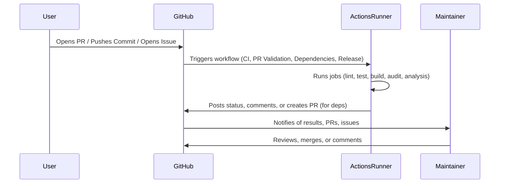
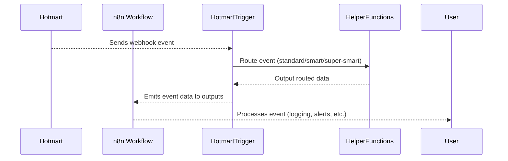

# CodeRabbit Report - PR #14

**Gerado em:** Qua 28 Mai 2025 10:05:12 -03
**Repositório:** thaleslaray/n8n-nodes-hotmart

---

## 💬 Comentários do CodeRabbit

### Comentário 2025-05-28

<!-- This is an auto-generated comment: summarize by coderabbit.ai -->
<!-- walkthrough_start -->

## Walkthrough

A série de melhorias incluiu novos templates estruturados para issues e pull requests, múltiplos workflows de exemplo para n8n, automação CI/CD com GitHub Actions, atualizações de dependências e checagem de licenças, aprimoramentos no tratamento de erros, documentação ampliada com exemplos e instruções detalhadas, além de comentários JSDoc em TypeScript e modularização do código para roteamento de eventos e tratamento de erros.

## Changes

| File(s) / Path(s)                                      | Change Summary |
|--------------------------------------------------------|---------------|
| `.github/ISSUE_TEMPLATE/bug_report.yml`, `.github/ISSUE_TEMPLATE/feature_request.yml`, `.github/ISSUE_TEMPLATE/question.yml`, `.github/ISSUE_TEMPLATE/security.yml` | Adicionados templates estruturados para issues de bugs, sugestões de funcionalidades, dúvidas e vulnerabilidades de segurança, todos em português, com campos obrigatórios e validações. |
| `.github/ISSUE_TEMPLATE/config.yml`                    | Configuração para desabilitar issues em branco e incluir links úteis de contato. |
| `.github/dependabot.yml`                               | Configuração do Dependabot para atualizações automáticas de dependências, com agrupamento e regras específicas. |
| `.github/pull_request_template.md`                     | Template de pull request ampliado e reorganizado com seções detalhadas, checklists e orientações para revisores. |
| `.github/workflows/ci.yml`                             | Workflow CI completo com jobs para qualidade, testes, segurança, análise de código, verificação de release e notificações. |
| `.github/workflows/dependencies.yml`                   | Workflow para atualização agendada de dependências, checagem de licenças e auditoria de segurança, com criação automática de PRs. |
| `.github/workflows/pr-validation.yml`                  | Workflow para validação de PRs, incluindo verificação de labels, mensagens de commit, análise de arquivos e comentários automáticos. |
| `.github/workflows/release.yml`                        | Workflow de release reestruturado com gatilhos manuais e por commits, suporte a dry-run, geração de changelog e publicação escalonada. |
| `.local/bin/test/test-full`                            | Script de testes modificado para adiar limpeza de workflows e abrir relatório via prompts interativos ao final. |
| `CHANGELOG.md`                                         | Atualização do changelog para versão 0.6.6, resumindo melhorias e métricas do repositório. |
| `CLAUDE.md`                                            | Inclusão de regras rígidas para fluxo Git/PR e gestão de tarefas, enfatizando práticas disciplinadas de contribuição. |
| `README.md`                                            | Documentação ampliada e reorganizada com seções sobre IA, instalação, troubleshooting, exemplos avançados e integração. |
| `ROADMAP.md`                                           | Atualização do roadmap com conquistas recentes, metas revisadas, operações/eventos suportados e reorganização do backlog e métricas. |
| `TASKS.md`                                             | Novo arquivo para controle centralizado de tarefas, progresso e métricas do projeto. |
| `examples/README.md`                                   | Guia e visão geral para workflows de exemplo, com instruções de importação e contribuição. |
| `examples/basic/01-simple-product-list.json`, `examples/basic/02-subscription-management.json`, `examples/basic/03-webhook-handler.json` | Workflows básicos adicionados para listagem de produtos, gestão de assinaturas e processamento de webhooks Hotmart. |
| `examples/intermediate/01-sales-report-automation.json`| Workflow intermediário para relatório semanal de vendas com notificações por email e Slack. |
| `examples/templates/error-handling-template.json`       | Template reutilizável para tratamento robusto de erros e lógica de retry em operações Hotmart. |
| `nodes/Hotmart/HotmartTrigger.node.ts`                 | Refatoração do handler de webhook: modularização do roteamento para modos smart e super-smart, detecção de pagamento e documentação melhorada. |
| `nodes/Hotmart/v1/helpers/pagination.ts`               | Adição de comentário JSDoc detalhado para função auxiliar de paginação automática. |
| `nodes/Hotmart/v1/transport/request.ts`                | Aprimoramento no tratamento de erros com type guard seguro e simplificação do objeto de erro para compatibilidade. |
| `nodes/Hotmart/v1/types/subscription.types.ts`         | Inclusão de comentários JSDoc detalhados nas interfaces relacionadas a assinaturas. |
| `__tests__/integration/oauth.test.ts`                  | Atualização dos testes de integração para esperar mensagens de erro revisadas em falhas de rede e timeout. |
| `test-report-real-data.json`                           | Novo arquivo JSON com relatório detalhado de 48 testes de workflows, todos aprovados. |

## Sequence Diagram(s)

## Poem

> 🐇  
> A hop, a skip, a leap ahead—  
> New docs and workflows, smartly spread!  
> With CI checks and error guards,  
> Our code is safe, our tasks unmarred.  
> PRs are neat, the tests all pass,  
> This bunny’s proud—release at last!  
> 🥕

<!-- walkthrough_end -->

---

📜 Recent review details

**Configuration used: .coderabbit.yml**
**Review profile: CHILL**
**Plan: Pro**

📥 Commits

Reviewing files that changed from the base of the PR and between 66a8bd6a8edb1763d1564e02ca13e5a410ade690 and fbb8d17383b923c00a6e9aba5af9239c08c95011.

📒 Files selected for processing (1)

* `.coderabbit.yml` (1 hunks)

✅ Files skipped from review due to trivial changes (1)

* .coderabbit.yml

<!-- internal state start -->

<!-- DwQgtGAEAqAWCWBnSTIEMB26CuAXA9mAOYCmGJATmriQCaQDG+Ats2bgFyQAOFk+AIwBWJBrngA3EsgEBPRvlqU0AgfFwA6NPEgQAfACgjoCEYDEZyAAUASpETZWaCrKNxU3bABsvkCiQBHbGlcABpIcVwvOkgAIgAzEmouGwAxAGEwAAYsgHYFZm5o3DQChQp/AHOAV+lIJUggtC94WjQlUNj7bAFmdRp6OUhsREoI2GbpL2c0eQAKW0gzAEYAFgBKcKZC4rrcWBJINMyc/JsSbnxEdXwXSABRDAmMBhI2DFxkAHd1WHQfFA0ZjIeLeLzyeA7N7sGKYejwF5ebBKZCQy4UEofBQNJotXDyeLwAAe0g0MAO1jsCNwFEU2FeyGuRMgJCJaChkC+twA1vEvPgvsglMx8BhEDTqAiiJAJM54PgRpAABL4XDMZy4YajRhoUaIcIOBh/XU8Wm0emalriqUGnqIBgUeDccSiyDqjBoUjvMKckgCWD4fDcyDPWgtDBEA2TZD+dGatB4FiS0XhOEsiq3ENw8PSoFFaikyAASXjXkQ+HQtFojOJkAA4uolT0UIgHIc054Af4giEIm98zRUVgrLdcNgiMFtQR7Ji2hRaPAAF6HJgfR0CPDysUaIwAQSr6i3zXB4UJUnrjebu7EW++PL5AuQzkOCIYSKU9GnvHwEla7YKRQkDQkDpEWAD06QACI8E6JDhiuP6UFKCgfAi2AKkONBEFQLoYOEna+N2k6arKLRtLhqaJuqAx+HBSR6pAAi6jErqrlIqGis0BR9J84RKNwZBKC88jup60IfKmGD0JBFyCSoqooYSE44VukDxJmCYENR8AMPUslSWQDDyNg3DkaSRjpIohy4uoEKFLSUjek+Vb+K26CQOGmpfM4GDIQikAAAZESEGifAFjF2YB3rIaUiBoIkESyAJkATs49DqXwlC0nwoY5uErneOIEYoFgy60h51Kcj5UpPlJkAYBW0BJSQADKDpOpqWW3IgZJFh8JDYcmWCDp8vr+JWQgjDR07+HyoiaiZZn0F1fBsK2Yn6ugRrwCQv7FcsOQAKR9uK3QMAy3y/P8vgAKwAMwABwnaN3C6tcEZkpB+AMI47BDWp8DRIy9LGsgAU2AA8rukEALK7lYGjMLQ4VpgF0C7i1ADSLWI8jY2HP4v6jJ+FbNPARBYKCPjyD8+z8PEhIMPAXEqmqGqQPDRb1N9v0fEN+VvD+yGM5E8qKok1DYK56B1d+v4LsVaDnVLBamvgIhiDOks9UYABqZPkapr7vnUhoXVTLIkj9uH08MvnxnVXx+gGQbPZtb5JFgnm0Q4Xi8em2VgPE/iHE1AltY6zoAYD/Nneb3iMdggO0JJ9BSI6hIxAi4rHv9/n7IcGAPVgZC/rSGDemSlkNEw6diW6QGOgwT7jeK5eRpyV2IXwACcd3HTnQLsLV9DwcgteUHQqf8OnkAPcsx2gi8uHj93dA7gYcAvoUSuavg8TjKgiyoNcFPwIzmCahlelSPyAkUCP4yHN+GucJb7KAZy978oKalK4D6hVaigEPgNKNoQLgSgl/CgvIf7IDIA4caoIxzjUWDZfE088zTEHFrKSYDlwtjbDLegiwHC9CQNcUUPVySHGONkPIbpAYhFFIcdUMDkAv3mm6SWjp8SdzpmiByMQmA4mwGTPhaZ/AtBUNEbmP1vRDQ3lvSkbpFDnx2sgAATHdAGQMSoRFVM0VMB59oADZ6okC+LouocxWQfyBuEBsuAmwCD7DsAsm0uQwIfIKcIMkBJ4JAZqVcSl1jEOGKZSUxV8isiQEVaUhI9HG2RMhcsUtXjYhIOEEam1aA8wURRcJoFoGwMfGSZRRpRDcitME0UhIKDAmum7Hgb1wjezTGHVq7Uo7PkYNETA4QNzJ3CdnEoPh/pmxIFPcJeT5F/RtmmLxpTf69KXjeTiXgN4ADlWSanFBcJ88QaCrUoEQPyiJkSHH3ozZmvhtiARtvvI4GR6G5EolpAsJC7CkVaP9X8pRQIQUguEeiO0+DbGYNge28hVw0ngBuFe4xaTjj+Fgjx08yDPFePQEYYxgGgPnMhWmfw7EciWT4nWBh9DGHAFAQSttNKEFIOQHCwiWDei4Lwfgwh5qSDqEMERyhVDqC0DoalJgoDuFRLVHABBiBkGUDRCF7AuBUCsQ4JwdwBVWSoMKzQ2hdBgEMDS0wBgNBnP2D0MCRYWotQAKr3AAPrQHuDDKwAAZXcLqwIbiII62Mo4NCyGYF4DgBhYgRoMBYDmRZ5Uss+d0TV8gnlGkwKQRAe4LFWKcS4whwQ3EDkOIkwu7IYgBV9f6i4gbg1eHCt5ZyH47ZKD4AFc1vwrU2vtU6l1brPXetbeSVAaLgKoBROTcgJNcFzgXAQ31tE4zC0zAXQKRcMBgAaiiMAAY2YYnCpwsQvVNTJJRO5NuFopYxAyswfhfxIV+ydLIzOXhqwGJ1M6C9ekShMMGOOEqV6hpcFKO6citx5BzpRN0wp+zuDIBmhcM09IsmWwEmIGIAgSATF/LcVMYgxG+HQ5h+UFBwirplJQSheEWkMG5PXdOFGQUYDLqKb0iUBIC2iLKLE/IiCbTTO0BcuEuIIn/bhcpFJh3tjLBWY9dRSiVOozUtSS6KQBoxGMacIT4ANNNERvNhxRjOCNALb85omZqDxLIcIIx65POXdg3sr1qO0fI1uaePwfBSnIG5L8Dk/zPUYP4IS4hmjUOUVegGcEX1kAyhkoiWmYg/MNlQ/gWB2riAYEJjAnhRrTgQR++5uwvOhfE/2ezLZOS8JoFgfyI4MTjknO2OqMnkAHC8NwC2+ZXgBmfeRkZYoaQWlvK+icfncUP30XLVoyFcUWznapz4G9zCWF3H7RVQ3pzLqUG+GYiKnmsjjCxPgngBAtF0uwQ80gjBQC2SwyAcxl2pojO2KsT4s0Xmcc2Ch+aJPWPCF8BARpysNXjJklkqE+FbemCpUU6wdwRtiFd01bbLUCGtbah1zrXUeq9fcMCmmiBBpDWG+HUbluxuZYqmIGq2HJoPo99NmbyDZsvK4r7hwfv45VjbYtgVkewA7ej7tWO+24/x4T2tVUG3r0HavDASkueqQXHFE7/LpgYGDGzgLSQbZDFGLgeJgUTuYG5I6tniBHVkBkXQcK054ghZIIe/45Y9KEi86eoCttYW7wqur2DEx4zcAEs4dAyAgg6WDLNSeLw6jXzG8gfAAS/KtknGJ6QhxwzciHG+S5cjeYlEKeSn+78oSbWXdcnStz6rF24lC2yklZVJhtvaF2XhMEUnL0zFmqo2Gak5rngpW4yT3CVn8L3msM9Zlex6Ng4Q7U2HddPUoAhHQkAPhByONtpwjYaHH19UjdqXx9gqCgDJFuk45qt6HYpX2bdEFDoa8eD77dHIdngPRTtg9FpdgwN3yBw8jVSkjhavzqjp2hjj2tjt6hLCgiQJWj2OKOLsTpGtGruOTgqqyvQNTs4LTowM8AzgYLuG9jmp9snuzqVqrNPjELEIALwbgAhTuQAtTjghAADHFYDQqQUKTMGyvySgXQcwqQ2uH6jBRA6auEYS9alYjaUKzavOwBAuXamOvaOOYE0BF6cBxE4uA6UqBaZWo60g46MQW+ScO+ow42/kZCPEBuqh40wU4oIIymhcxc66VkiAW63e7M+6mgxYR6FyJ6Z6uGgWEWz69hfA6+8KyEy634Ku16y61hhwXI3gmB+AXgUg2SFI34lwxM9gyRm4KY/wxyHo4gUgsu1wza0yvARGtkHku0cE7GCarMPeHMVgXMrkx+rwVmcUpAxegEvGdUfeke/g0e1C+4AmR41M4Q6g9MiQ428m3IICJIIRWovW04CIC4GWwEAYViBcMKmAKEcKCKhw92IQ4CuKOoeoWwVkfE+S8yW4YSfGuBVSimGmdSWmMRBw8gmG+mSQJ+Bw6UmY1wfQUOempe/uT8akgh40eSdQwOjAUsgxUQ8gsS4obe1AgIX8iRjECqhIe8BcfAceqeOhqsuKyAbC3IeSXwlMmY1ICGYgoGfYRIDsy0cutwDItEYegRiWD+KWkA3IJABIO0wRr6eW40BWQECqbktmFIcRbJGhRgS2F+xyXJG2FIkOO2Q2e2RIB29AmYx2H+524g3+12li1ikhdAXArachoBguihkBuOcR6hIUNa4USgruMU72uamuP2180ptho0xKbohUD6+mA2ARWcWWeAQRL6aYnJK8/+COgBYARgfO8h4Bwuyh8BomNaSBCOKBaB8aNEWBdwKaeB3+hBTO7pJBRCP2lB9AsQgAyuTWCnJQolD8DYCQCQQABf8saAXQEh/GhhFYduTMeIRJphQ43Q5C+uyEGZ6poRCoAgo08kEZIwERFIq6zhm626jRnhBJP2zWp6IZMBfx2m/pd64gn8T61YgG3CMC5J1Wa4dI6yJcLwx+no02Y5r6sx/eNxroaYpKPRAMD8uAAA3DKfFp+Lss+CaNfMujOXkbCrsm5qCcumNpPv8P4O0PIHCnQKBbQLSKZAKNfjBRSGNgAOTwKalISGTp41G+D+mkZpgPYFhEB0mSnWTERbigW7EJ6Ca+AABSLUEMWyYAgxZREFDJUFSmfAiAEwjoxUD2cJ7AJSPiXFdUcmBwCmcSn5Lx2m+wqJKFphaFhMO0Ts9Asyeesc/5Dipou0Ys0qbYvRn4yFFImuqApQ1mXRcFWAOEBwfAelWAS+v682u55BwEjK2kGW1M6AgeLQdQsQXlXQaYsQ5AdArhcKYkXQ0w6GZY4SeufuL4pBEQ6gsivAq+tY04sQAA2p2d2QALpcCxBkg3Yh6nwpUtxfGahDAukJh+xn4oGX5KkVi37bZX6P7IYv7alHbv46Sf4XYZpUqQA7LM4fas6FVelMKyHtpWkKEQEi5gReWaGmn0D+mlAukIhU6VLqhSVLF8BeVPggIRnrkbrSBuE7oLSdEO7hoAEQCJlmqWlo47VpneqjA/S8KyCIFfU5lk5xqU6YGOA06e4lnzVlnGnEGrVVmhUlpsC1nUGABIu0cFWhiMHrrN4PGuZjwYcA0C1ANCrBgJUD2ZLkda+kOQAvngTNIJcGKPCrIiDVLFURIKTUKqzfIPNlKCFe4iOr4bJkVVEM/LNLWFVdTaDbZPVXEG0ioHBPlXpjenELzWDYlXVLEBUbcLZGAGljpEYgbfQG9OOqiJqNOLFChuorpGNo7uhmctfidTeWSYRfYLyq6P5dyKuezQdnwHxrQETMhBUbKMBKLcVNfObZFTKILbqqzRogSeFgXKlskdEGIIyIeRevCMyQ0v9PsMikQH8LKI6BhCVNlqxtINeXFoEXhQnneddaMOnFUdtq2M7f9P6epFLNUbfMgHMOkLwhba3sqOTLAOEDDHQPAI4OEO6gKOsKBU3YYZBRhYsQLV4GTcLXpPaBvq5igDvGIMZjSU3jQDBndqVUHIDNEMdVdKUK9BiJXlZSQJsGrE8imqKK8FHHMP6TJXBIRIJEhIrGpVVBQL5MVDCSsVLX7VzUUZTdQGgJ/WmA4CISEDEDxOTENFxWBYEQiHXZeddfFIkKhmnC5lQqpdbQQ8IhpXMfgMyNhAqNwNda5JzdcCrvUEgG+FcPljpdpK6P6TxethWJptpg1GurqTNUrnw4gkhp6CHK+qUD3FkGAG0DTNoAbvfPKJNQDMyOhhlM/NNbpHI/yAo9PKIxsuCFMWMK1mw/6bEcSGSKkAiMeJZmifudxc6GMfSSUBhdddHarGPj4SJsfcDquaiZMe5vhiYydjpLY5HSruLYWmDjFnUOvWnAbFyaxOPUnZebBhWMKQhFCFVtIJSvKStoqYisqZTXfmqclhqVqfwFNQk2duDholdotajSztretbIhaVtQDamUocDaIHzfiIdf2Y/XTLFAXYEeFtfHrfzSnSoPvXHQTpDYjr9cmajvxHJEEhDSTrmTDRgYmgjcWWmqWW9v4ocwpJzlfiaUMyjmBAc4EqqIdRMDIFMgFVWAOQ3tRPUwEkJEZBEmZNQiWC7udbBlyOC6rIXo+FwLdtfFlteu86CxouEpgKqL5ddWjRzE+dQgAEK4vKVwLoCtyVLmgP175Qq+gkDVLJpYAwyiiaNPiahZA9wcA5AcwwwMGsHWA9VDWQgO6QCpCZhotpEIRy7kwK6ugtA8Tx4BJv5diBDERFOQA3Spg90UyPy+kxi2XGnBwsCnpO2Mw3WpgxVYtZWa3Tw/TigsBLh1AQqTFrQfU2WEgLHhLL6YCA7T7IRsTnZUKO7jq3B1DqhCCZh0aqSLQeLXW4BwuJ1cQYuGRYtzABTrmItfAox1SZtOFMD+ABSw7eFO4VgsMmRCj6SYt1DUgVixBKASAaPVtpvSBW1xAjTNsgutuIBdBMRZGugBvFSvT66UDX6SIhBNyjRxs4L5wHDagVvX3Th9ANRh2yzUCA4xtNMYDggEkEvXiIrZv2CQgxwUC2NoDWt1C2tlg6utWvZjbTzEnuSxBMxdClVevXWuuajusbR9XLYDW1NDUqkNOjW2zP5qb6MyMdNf7zXXbFOakTWtNv7tOzUGnfCTxM2ZgigLiZy0CgX7CoD04vgPmmbS3lmPP/Q87Xx3MfNeS/AKiljHKBtWR6QjUP5xk7NJn/UEQOniiOoSa4zZnn6oFnMJqFk4FEfzXKIEQym9g/YSG7IIJ8q2P7Zwiwh1SuQLPS7KJhG+Ougg02wNRWLfiFCjTXxKBfq0v7Zq5cmMXpG0jRGSGuTEwEmxDQBOhsGHAwzIiYD01dAGeqQSGDGlrW0aer63DUTTT1tFiFXnDTBcEehtC9lP08DxcYbJEyHTgT7LpSIJps6ng50ChobyClDlluced6SQDedtB00M2zGKb+kzvqfLSalqf0DrEDQm21u+HITL5JBB3FSSc+tJzPoQRFghXWjFSjIUCDbJZOw2EXBpezN/CIDmszXv0zgHIEn1daUSGtW90fAqdZW3B5cfAVhnlBk6hYQm3Lhw0CABfJYTxyXSiCoziyDRAGhwTxAiVGtfB/bVQRi5J+jjge0dw5JXFzJ8yFLoLzCeTZLNSzGDIje0BoN1T3KSjk0YI60WfaC0vqBvCLFJBGhkgo1WKxARy/MyWqi9t+1PmM0zPXVEx4a4HXPDEHi8W0+IqouqjSB8QtsvAaLTzGWWJjDb5+vxEYfUmPnTLHpuk4/fq0S/gi/goMOKb8bOeBtQ517+ZPdiQQ8WWFJ9doADcvdI34SUD/rR7TwrNTM0IzzKAAjycmj+C3BECYDOvHl9JygSJo8sAPLimeJXTujyDlkmfOiPw7enT4+NK5Zigfr7C3AKgV0qIWEUKqQTtK9fB/sKlrbJZ1Osf367ZP4IcQdIdQeoddMLXNVDe5Yl80Q6mmMV/SCgWii2ORFgiyenQ/aklt084SHYfqLrzbMJlcfDPZuIB47wDHPIHQ0U7nPieI2s9uAIDIDln7tEvksCj1QhdxDFJQB9RYRUCVCCuWQfAAC3GAYiXQZ1bucmfv/gBwXN54sKaENd1IA0Tz3AsE8EEQjomDgRroTwEA01YBR1QCIXNvQACiNs4ICecKL6xeDztwkMnA1hEGcCkADcoA7QBgAHRQtVw1wOwrbCZCQAo293MNAYGWBkgAAVJQIACKeGKoukAYbUCUgUKePFgDtQbgPgbZf0jdiUAaAhAyAZYA9A0DMgOwaLOeI7lmLx4IysRDvgGhDBxJQMWwEfHUFTYC9eeJUHOD4HyrMB8orAn3PEnCCdII4HUeug8WozgIhkgpSIrSFfhC9CaOWCkFYO1J4A661wZcBvE0RUDKB0AEIIgGYHtlq2bAsEjD2IGCBwkM3a/K6A4HNluBKXaiI6GZBPJeBDuAQWRgfhDYhBIg8JJoiyAiDQ2/WY8FW27bqDNokQ2DH4P0TFJsOSGOfvG115dF5sbA2xq6BSGQAshRIKzEUFAQvoGh7OCsNXFEA/hreBAaWCNHnSjgnwLccQEOQWxGA7o3gpWpM1kABCaOL6V0KEMkT6DohnAscDrRSH8DBBwgokI7gTACZihoDUoTrW4DiCzhkxOYMeAFDIQVol0BPhGTtwAJ5KFIEgXcQ076CWoGAWQMGB3p70LM9gDLFEJ3bMs38wA19JgPAGpgpM10J4cVBeE3oGOf8T4bmG+GCAN4qwbwYMI5gehwQ+AgITYG2FQjuSyA9VpULTAYtghMPAoVoJypqCmYGg8oQwU4gUB0g/IZEOCN2Lnx3IBAXktVg4SuR2A4QOoTgjv5QgiQVRebNPEyKLluISlAOhSFITw05Qi4KOm9HoZVIR6cPGAM1BMHOgkeycWHEYBujeC4u9EQ4IwKqRkiKRLQrAEAMQHTh4R2AmZEEO5Iw9skIQa3hMzBphD7ukghhqiDpzsp1ANYaPGCWmBd9PQJUbPA0ASDa4ugmYBIMSDfby1vW04CzpQBXYvgD4pQffMxCBxTIPw4QBjtlj9wnx88IwaeIKJSoViUo6BeNqdRcAiV6WpVTPrbAewlluMWoZjoxmDbEiza/Y/AFswMCmJvBN2GYRbVwiOjx2XgbyLIEOTHJGg9ArHiNADHK0+EJAyFnsk1GOhlwWtAqH7DGoFxtQ+48JB8JyqCjMAOBAuNelvHTJcWlAH4NqAkaNJYo9IeOPhmR5KIKQR7J9hlm2jx0dS4gx1tLDTDPVHU2HbwBoIcCB5JhAZe9J/AOFpCt2RFJdMcQjATF+og0HBP6UGG1xwkAIoEZ+27j1x0GgYqovaEwDQMO4fGKiPUPHHShuxJlFsfmUHylsQsFYJUbVGaCrjUAZ4xcsgEWDKoPgj8SbCelKCu4uIzgrWGOGBhJps+1TXPtfnz6qlQOzTRDg3xQ76lK+RpZarmgPZDYj2POF5iATAjj9J+0zf5st1QnnlZE149BlfSmEH12o6Ga2iAikAccR+f1Mft/EfBvN+ebInqFmW2anMpRVOI8RJyRqM5emK1Qloe2ClWIaycQNYT210AcwxwZMRcGgGP7FMGCNNKgLVy6CoApepHSdOFVVisiRImAMSCxhom7iYUYYx3HCn/7BDSgTsRlrY2bx0AEJd2GoncFZZ4ISumoHuHy0gB2poA6QT+q6HdDM8lcI7IzOEkAFyCaRBAshrymKgBRHMNGUgIcNFDhRMw+0tFmAH5DUYg07IWtIBPiJpToWbuMulMmDGIAyBFAyANQJt6yAxxDoygSwMhEzTdh2ALYGGNbL20KQgqT7tOzYYYSjh2QsQdwGvQPRpWLoi3hF1ewmZZua6VvvIHOnIycAAmHAZqBimvYe+vtH6RMIxAlQ1iUSaUP9iAh4sQRQtPEFi3m5FoFQUkLofyHaA1jDWcYEPDLEpYzDvcXtO6Oo00a0QqsomIwF4K+mUCmuXbS4eFMXHBCYhXA7JH/1IAADKR+nalkNKw6YBlpSAVabAFDH6iIZYJaGYpDlbSwnElrP2rDMWpWRDhSAqVpoLGQsiwpgvCIfoIJnXoGOS0G3J5xoCawg5CaA6b+1LZkz3IFMiktTMtBxJkIrI9mU/VlAxxuGTXePOCkEZPgAQvSEyK+jMi9QD42cy2HEgmKagORAc+FsBAgANQwAcUKQCHLrmsIEQGkddrgE3ZUNIRJ4LWOmhZ5PZwxMsTxlnT8D6Cckd2WuSNAChtJqQ8PFDAwzNHPoS2RYA+FPNeitgq5WuNsaqxAYZkdap1ICLj2wYVN64hZJcMHTbml5ewokxyp7Jm4b9r4wvebsVkODHxx4GFevgFUYhlTAcUAg5GBEZRgAmuc8nWte14y6s2q9gzPr1kebTI7OhweAYDj0K7BraRyMYGwAoBHT5h3g07AghIB/TqMas7khrLHBgzLZGIh7JcSdnIAi58M92cjPwnMiLhBkUoWjM9lFC/Z1+AKAQrFBELZilAcKEQH5BMQoqW+VsWFQqivABFFzbAonMdz0TsJR2HnqhA8ZqxoikoXSPwoYhzA6wHqcILuAMUL5IA7qExeEFtSGLIAxLO1C1HdRoNA8gkEEKsRqg34VMDgx9t0L5lgl5sQs3YhqHPhiyUuEsjRrMGlkjiN4K2XwNeJkybcl2FYEyLzKcokAtMPsFDEg0TkeTAlswxYvZj4DZwMlPE5REexKZPgWJNEeqTfM+6tSiZh4PCeEl0WlMigzMGMZ3Qvg2x/S8vWlps3CSwpaQPgGIBJO/mD45SwnADmIzBLaTcmxfFpvpL1KdNDSPTEyVeA34WSNqVkq1LZNTmkgnSTNJxrAGUb7jzSP04hdyHAUBQlZOyxAOAtRhNKzlraYfj9VH6vNbJvAMADGUHyRSTms/KRbFKTSL9h5y/VAGvz6ZmS5uj0jKbEEWBQB9YZEQqYKwaBWAO+5wDMl0E6k6zgh1Iw+TUSkl3YE8CqFOCyAEzTJEAsgBAeXGda/CzKZVN3APT4DXjpwMZRrKFyEkEJsVGrDOlplOgkDwgAUZlWAF4DgKpB4wfSuqLsDfN0AloeiHvHIBmDr2akWkNemfqBZaVVOD3Ish8gjzSgsQI3ibzHHXNMqGtXwB4HFEfBThSI9pViz0qQyP5dgXTtzkK4rJCSwEf0lk055DY7OYqlcKry0qSrUS/SU6Ldmj7e1tOFIEGmy2DF8rZiZtSMWFHCDMrV4rAN1ufMHkrlBuca72F7VW6iBB+7XF4tKDTDcYtaTAZsrbBw7TElKX7euvYWkL6Jl0EkuNe/MPjzgo1gUGNcWhuWSQ2VMeJhOPBLJF0wStgVMCIX8Bu8Dcg8ZOc3G5L8ZDwVCPnsUFvDTwec+IASAeOBKQNGJixAfh0smX7SlYh01IeWE9HEoMRhbDhmy2QhXTgwPObOerRwVFo+1OtbuFq15azqV41vNoo+r0REdluGIpWOj0BERFewnarlcSLbUBQQFUg8BfSO5I2DbKNdF6YcFcmywrgo0TMOXKXwPN2Uqo4aOKvkXHjr5ny10PfKQG+YFY0ocgAyXiWPwZsCcDPM2uAkMRINRLMCJaSbmQZwoinJ/nBAJCZgHWWkGUDk0RRph92zREqIqSJbTwWNK8PHAwwY6tzEg3c1FB4syI3A7ggqAklRIBD9LkiakIvGUr9o9h1FvgYjQFTC4LpioTyRYGwBKDkQ0AFxZNZqF9E3iNqknNSRMrz5Ad6mbHIvuNVL7zL1uiy2DssorKuJwVntR6ZZL2Y2S0pE/d5WZvsmNp/SxygwJAByn8rhNRCoVVwETUqJIF4SDnH72kTR4dw6WqAAFBjVfsbluWrLUmp4gNx1og8vjMSNkAnjuIkxVdeZHK3tqGGd9IGAFEAytb2tv66xI/DNybqaoZWjLVBrDGDaeAaGnOTfNPRxSVRWINUXav8nPLApryuLWBBLGjBp+UNGNKJwLKrarmQKzeBSHX6pTvEReF+XRFLG1TOlJobjdcFvgi1J256QIn+SeDi9aAu5bWWMFG0mtlVtEQNYcFxX21SYMIv4Btu4T+QUFxoOqEtJTamyN2M9HWkQzwCr8t+svRWODttFgAutuBfADpEOJmzwgK7bDNwijYUBqV7kPCr9MiGMRAw/SSmNMAJx28DtyG8IUF0tzY0+ll63CACxZ14zuSqO3wCtIx1IdqtexLAchEAA4BJVR521VAAuAT1qKQP7XBQYBajuT8YyGNrhEIF0xB/SgsIQPADACYp/tnko+vOskLPDNSp2SYg7Io465wu40RhXrhMgEkbhhMrCYzTvKDRG0oO9oXkIOgaAsgr6YQXbyPZGcuF2gvSCUPCl6DNJfgleS+hsHqx5o9rcGeML6FRK3s0GT9PmJha+LHtU4ZqCyF+BjBQ9y6SXbXQjKZghgjU8ENqIzVObGtH1aMRkjsy6h7anoPnmHINx6rA2ZvcEjwg0GZgvWGgtMLeL8gHwpG7YJBFzIB2QBdYvcxOIUBiho82JXEjSZS0OC5RiuPAcQTzu4hwhNoSEyzdKCZ2disANQgkuWQD2oBdkVAChoqtNZRyjpAg38nVCrHvD/idoGkViGgyUp159UBSP5Dv2RDpWm/KxA6G1zS1v97OZwOIsnqui9gnoTVvXqwF/y/WmO2Od0piDn7gcMeJVdbL33+lRkucG2NNxxmPwGN9rb+dLQJbn6Dlz8A9dRP1wqC19I4cUD9wh1Cb4VdBmMPS3+SnpIMi+OOBU0gNzj1igXK6FRr2T660wNB8ZDbAhSX7ysFRfqADszSjAX6BYLYIpUO7yAlcVuegCQKCbTUZKERCsFsisD8s+yDkv7ADlHzgzqFUM2hXlQiQuy+BAg+1qKC/TjtUuSsdLj1j4DEVC4hMmRjJQv11R012Iw4I4f5bCiyAG8CGHXB8BwGj2EhCUGKCvSXoKDsUNELIgD0bhCgSA2w3Du8oV6VwIy10HW3cj3IH+SnVIoCwTTn6v+AkH/v6S/ZgB+2JB+o2YLzFPk+IHYlndftHBD7T59AUgzz2QBSjj6bksSPQDiMIAPoYy/qjU0mXDVC+6pWZXpLaYLKYO3TAAOqQrS0Q80gOlAoPgx6jrch40IagDIr2mCKisLuCogABD9LGgHCj+RNlqOWyTzs0ILVLjd2rfhivgUDrP9zAMND1qCiPGWQ7EOjnTBJ2VaWDyMNLQYgRMZbXRXG1E9yQ9FwD/5sAHExVuzaOppdymutFdGx2fA8TiJnncTuajhQ5gRoMna8E5QY6qdHc4jLTpp3dVCoLSZTesBxOImYDUKdkyAmSKew+eduEU3bjLAf0FqfFcIUiYh3hRgugu90dQUAABewTSENfGtIvxnSPgDpN0xVwoxUUHiYq3nwuAlpDQFDsdSUFIAAAXndOQBSKVJmk0aFIqQAAAPoGfl3Zw5gTpqHRoAODtBHUX7RGKmqQykUVd9R2qqRXWABQFqIxGINYf2k1H10yM9kxYZVyDBzDq+HqrgDCTek8AH6VI8hytCbGGZvwO04FHKFgBbTwwEGZdI8S4AMziJpse9MJ3MRezGWh03/BVPDmoAeug5J+3k14BwgXuoCCZGnjiCNjYRrrBlzGA8CnDBiEUWDiYwVwlKVdZmCkyeVI4rpzQH1AiDAgjRrzIQIOGCCE7RS/lcNAFRdvwLKJD6HUcivAb6Sewi5xeiQiDpKMBUKlM1SENjWZix1BYpEXsb2HH4qMXcWUGXv1Hf2ZLvwF0KVWCXpRsVwRG+XqP1iSDak18dEA3PBb/6wB4wmCvyunrBKfmo48e4TJjLBKoUbVv542Y43vqYluYcq9/qheU7yB8lJPKi2CXkkgNBZyxv/S+YRorTpgY88NZBjVimctaqFRmbiWLkkX2cUMrE/Ac2isgJmBuB7OzqLni7BRBlYHXnNLkF9zqRKyYoxYaTKXDKmxV9JLtsYexdiglvcOzzGL9zSuxpXi7vD5SKWo4LhxtPFHXGGW/zbDLyjqxN7MXDKpl94lVCxDTgCVeGw4DFIgqnQ/F/kXWC1EGGWWzLYdbCFMkfi5XCRblDOVlQ+7l7BZPOVAKldhCgXIq4IFvriQ/FIZ6DG/FKyqzdbGyNFvSKnhSUsuQ5rLcBui3sjKMlcI6SAOoE5aZWcScuDgmUMzDBLHIV2zQe6QWhO53Aecbly/mwwzZOx/QgYbkD919gLY1Q3AYtrRDAHX5OCsJhFEDi37XtYQyAWIHmG2swojL3ADQF0GUTaa7kwRgZfpq34MWpasLaTChYCvngw+i5W1WDloDIs5V18I9ntaLlpgUWmYVK9fIVHzp4u18jiTXWe0zU0bbDaDB5t2NeaplIHGZf5vr4nGgtZxn/OIyRoG71QDQLSTTb83gd6bdZxm3NU10nxIMW201OkCVC7gtkdYe4O6ghh1hBOUU35fmX+WXM6cCUq7T6uuYDjr4AevIdOPMTmUnI1s4rUBFUhPI6EpwfCTSEfKO6qs72kOlcHU2Ik/t0eJyGSExh8kHdiKOJUQIwq0BfpcqU4ht3gsdcWKx4sMtOH7Y6RLb+Y+esYcK2Y0a1iIqXdcT0MAQ2jPG3drxJewAxzw/hI8mFv6aY1H4z9TaYfIkxJ2PI30fKWGRsVUBtRJW6wKOHqxp4SeakDvoCigQ9G4I51crFVMQyOT4LCdYI6/0VDv9CJx9RYGZveSN5hjEOoHsnpK4pJDB4SNYfJB8KH9FERgd1NSCTwOVD9bdqKq0RSLIWkxbpHNUzAtYftr4cmGXdtlOL3E4o0xMwalFbXXwAoKQ3cF/3uAZgKA4C0SeckgBlQKwWagHjxnCTGCFLLw/Cxvc3y0jxoTXSdLNFzqdQf7Xe+uJJxwwIBbK+0I6C0jcisototINyPdCeg5IN4X0SHvnljaRJZ28DYsbZSyKQxoYcMBGEjButCx46OkUWDXTiLF2TEL3QRjED7wErRqYEKHb0Tbn0AbA9wZh/cFxhHy3s5thhA93M2UMMhroJiLQFICpgYAGMbGPI6Qe7SEkHfUUo8gPhKP8gaYBB2rFfgNw4UzcaQ+WXSCeo7UkEOR2w+6XIRgM1AOkosBm56IOwtIBAGoANwLh/AmsbBYPOXZ4GulKdmiOPw3hWBbBXCWzU3BazT0WgFdK+B33GGTJt5Cg5Pn0J4CUBZFJQdNOECAcGDJtgPa3r+IqYWwjrLsYMIskek1C3YBJNEN7hUcEbnWPzcgNiUWLQC74vWOYPijASojmI4QDu9BE2HJ5/5SGHOHgkJS3cXV0gBnVntsdzBqIywxhEDAIDkAJi9kRCPmtETiJPGaYEUONAA1c5KacToaBaPGWU3NJ3mgvo0yiFHGAtDN6DnNSMDV9WbHM7hBzZefTLubdfV/OX0MnddD4/azWxOLbki3fqzj3cK4/ceI2FbJ2jKwRvilL91bbcyQhDcFN8ByyKjnAxSAChIuUXuMZ0nc9Ex296kp0bp9FhZLS024XD97D+f8ecyKAagfhzw3CfftTk3XfPrdfwMICqdcIemXFauQHwOVlQhYDYEQCVmNIOmpGo7ms4V4ESasYJ1GL5cpPBX0kkYG6PO5YD8I5G6Wueq4SlK2QHIJIxPpgKivKkj8WwA/JqSGtdQc3WAPIGdf73vHowzxvjvYlTI+Ar8rWeEfWYWYpnkCaCFPZ4b2gRg9GMjfvAqZjEkAzAC1c7jbiihRFWjKBqvxGmvoMGohXVxE/1ebWI1dUbp33dZJyZ8mXEEoIgGDASgLBxUMlfsmvSlPJ42pX+WjD0c4wkY4UHnCaGXTvRRF+mL9b2Jm50xr4WbsneAxxTcBtgRKHkI7hv7S0WKPWbykNIdrLjZgJREUz26xh9u8YRjcNt0EwaTdKNuyGjQV25etBgY57g3HPxmq0h2g6oNhvW8zxIcP3+c32+YZYT2D2SLrBhshGOBKTiSBJbp90q1p52P0Raqu2Y8CjoxD3VLysXgDHhxyJXfrn8w9vaAnEaH4CaMkhHiCyAIiuoT9ye6udqVhLSyP2j3Xt1Fq4kIRHl0JGN2AfBgGGNAFhnGxjrxnuYMj2e9EKerEjNDwsFCz4k2VPz6GV7Eju34rsBHw4jiMNB2iToP39URwOhnGxphQP0fahG42JH9zbL/WJ+Y4OiZFiG3sIB6pqGUPXuUsrCKaIBVOh4D93SH/R/2/WmUjx5hbuThSAQAV0HM1dIMSC1I8NvskpMCQGTvzVy4VyklxVVNCvzbJ4OycjNf1HW25ynAUkdDgtxFBSB9GzQY5DhSfjahekngKRFNdGIw3kiOkErrLFpAYXt83d56cU2LoZI5GD6ay+y48osrUBDb7hB6C9DsAKbGk0lz5oONNMPnvNiF8Fu6Z/PWeQpMF5B0b6QvEAAZkF+ZIw7s2xWOnc+AfHF38YhQNL9PjV++iDSqAvger+h8BMUu3HVLhF0YGkeyP5bPyjF8+axeAr3zFIe77DFReM03t/Fw3QZFC7zulocJ9IRRkgC62NAqwV9BD9MSW2aSbpVoxhnaNXJ04EwBOL9qbiwAWMTyA2z+VUfdEgY23U90NxkxkDJUFIIsIQVP50YhoXEbp/zq+CVYyAQpQoN82daVhOM2KGNG+nDdzV8Jp9mBjwi4hq5UoXRdC8m4aWjB3Q6WGWEJPwGmv56N4c8K3tkDpZNo6GBAaSQI8VuJQWEZ90MNYByRYyoW4gy13sR1AnkhRFWL4BF9iIuiWhjLwbpmaSjkUAkEs0sTOKmwQYQsuKAE9a3y+Jy411SKJH68SRQ1y9idjfo3jk/DgqBAmphQ9XCNXtztrn10pPkK8w5sAXyAUwhJXt4AvJcEQcCuoxuL1cikTBH4046Rb0J8+zdA4/5904tOtOP2JDxXoMTILTAcFeky/1NJPpuq6AuCUbsgI+LHRAL5CcULYbFWJHVwC9U4A/X0cS7GUr6qJu9s4FTygOIwLXytKMteGnyaoIlX5F8TV4Q78llmZnFHLyU4ATTU1YfHgWKcSKNHp8mhnftu8IjA2NJB24tjiPphJk2jTOYIvRmFmnhQhQREQhDbANwMEd9TK1qQ64HXX35ChDQyNgjPBgwN1iragBU5WuOfzgYkxTS2UYlcIqBLcE+F9DmBUjEjGrxeLIckUY6oUKCIBFwaxE/pTfeJUGNfpYvXq9NoK1QUN9OdyQxQGSZH1/55yIGBdgrCfjXZRXQF4T8RvoXkgoAm5Nbl0gzcUgKwAeRBUFHgT2Kh3t0X9F8h3hxATHl9kqlEJFOx/YOkWZgKYNDRmoCAZIizx3wVJEgxh/DAHIAl/PhDIdumCGHvhafXwCtt38aQEECiUJ/1cMFATukVg8AR/j+MbYMQJ3NmffbC0xY4cgETYeQPHFFA7AooiqI5AoqjYAGOTaFegPaf6CiJogYED4gUGKSki5wEAh0VZ6lRszph/AGkHkA24Zil9lGnE61tllIf6DpFgeEQnAR74S3gyQgkWWjsDM8KnUFg7gUIL/J6JbBFUhzvGFmj87eRTCeROPXHitxIDWSX/0XAw9le0MA0KzC5y/cOxh0GAkoG4Z/STRFMQAAan4Algz1QdArgZAHyBWidJBXBmKLrhHoyEIP3t1ffDQUX9/YUtU4YtgJEAEBskcPCAhNocgBYpgsMQhBQR8bHmkBIMJdQ98Msc4nCQNuOPwd9qwCYOUQGidmGgAgdIlxY4HVQLmT87/RyQYDrORqT80ahe4NnA0oA0B7xbQe+HsAe8T+jIBMfM+Ts18gwpkfYPWd+kpQY/ECFVUTNRkH9osABnyZ97yB2k/Q5jRgLkAm5K+hShjCLl13kDcNMEeZkIKGECDNEPpB2gsQRAyCxbkTaHAD7QAlVohJJJLDFAGMfcxYwK1KPAZAalHZyk9NQXgACtzQ1RHtgTaBpXcCVcKnlVBtfeY0MQbYS4Gd1zIBakshNA8IjBEJCXH1TsvaBIVrAnkaY1L5SMLCUfhS4LTGYxh4PngXs6GJyHCAIYFqG6BkJDEDaQq7FoAKkbYKDz5Nx7JoyQCpNYpwoAOg5BUMgsfZwF6Dj/A0LdgheHoTfdrqZBA/RYwiYMIIocLonLJ7ga1wAonkO1G1BH/KXEckLuT+HaBOfU3Ub9hQKhF19kISnxQgafDngRD1fdNVkNibfWUtxq6LUP38+6K6AI55wQVQ1B5ATv0xkLQoMRFAHQ57iMUwIYlmeh3QjcXDxxQ9mB/8daKmH4pBKLZB/MebdkLt5zjZ2BOtkAFEJplRw/72S1+/dP1pZvdNhk6sP1LMJaZxHPoMZCWyAkMKJIQv8gHDZETryRCVSOJ3t5TvOimd4vtUMk94RqbXlMcA+RUVpBEgOj3A1SqUYCh5j6U8gfE3sV7lH8nQASH9gB/QaFyDwkAAE1dwGGHdQwIASiEoCfX0OaolARdTG827ZeD8YEKLEABcNvfDihlWbXpHfVArCdld53eAsL8ZAGcdAO5OoDAEx9sfNfAO88iNkK1l+AzwMDAK/egDj8x7J5ig9BvUDk5tfNQ4zptwXRbym8q+Fm1m9niBoFW8mmaSnHRJ9dqgk8lKOdlHRtvFvkpEQw1QKwA5gT7xhhUXcQhNAd1ZT1u8DAJh1hh4YR7xn5nvJWyksFFN82/xlEF91oBWwxKMZprHUPR1sNAacSh9pwGHwFg5oG8GKhwnJShHwdoRyGHhjdImBiBjacekLBlEWIFP4w8HOBp5wInUwBYJo0UCmj63Amg7caeLCNehMAyG2wCIA4qH9JKnbyCgYaoRzQeRTbcxwv88gTBF7AinVEj7gNATRFWBDoCbmgDlALohYouICQnqiKDUx2vk4xTUAWFlgHuGOh8+X6MgBpxXIFMRDoP7BS43LfwD4A3o3wCeQMKMCWlADoLIEei7efMFsCYgcsjqDXYcR0T8+QkiOy9pkWMCW4IoRnWgiYgKYIPgow+JyAi8Y1Ew5YsLf/Q3l8Iyh3IdLI6rCOd+ovFQBdYwQ5WYhAfCCL786YS53qZLOQwjI8LAlJHkpkUF0K8DioVgIFguIayOWslAK4HCBUgXcBoEH5PoBLCsAVgLJAITZZFWdu/SR1fQ3OIu0q5jYilA5hOMemjyQaebNTrF6FET2xZVEEUnv4kfHjQqgg1GVzVwJ0U2MScMZEuhjFRGPoH0i5uDDlW48QCTSGo4WElyRtOZB1mQhXQYRxODWIKiS6IvaBgOpiT6KKBhBtSDOPHZUNHum4YtI+jzUpgcPFkAEQ490AyQQAnmL9Iroc+2dpjg8QAjiuSFoAL9QJBs0GQZdcXx7oGlCoJXx0glzH2Q1Q+IN5CH5RH3ojC9Yl15DrqUCNwA0Q8mB1l84oRENsQraZBqQo6AOMvRc/YGEBwfA6cPShAYY5E8R6Y4MFapJ9BsNjglAOdBqEqdQMjABcY6+Pb8ZjRNwuhpyYIBTxl+ZBQPUBxfnV0jfIFZwnYMpCOyAh1xQx01hnIg8PRMKQZeJZAmAVtyBA+eW+BEdkMKihjFG4+/wfkYQCgAqJtQXhx1prHHTw3g56exzNi5ou41NZYgGGAABL+xxNAqaRDFbB8AdFXrZGE5hKrZIAOgRyZeCUhJE92uUw1JlQEO8R655KK6KzikMTyEsFkeGQ3yc34xCM/jEo/6CoiisewVW4qEdnFFZUBB9TmEDAU/n2Jcie8jzs1vcaFn9IIuZi8sNkGjUZ4iPEj2Kg+8Xhy6FDYYqDUTCkZoIlivkF/z05twRKSsQA9Ffiw9wIhnkvl29aUG6isQHnUfgC4NJV89YATJwotwDQoFHBD8MgzNiq3GIH7A2fSJMrBfKailfQO8SvCQS+8TxJWNwvKbCm4FPGiGQiEdPmARBeuA9QOj81AMMx5znOqBGgAHV4NGUDAPTw8YdHRH0f47bX2L3gIxWVgaQhHcTREdbOCtw/jS+ZRPxjt4olVJj/4L4TloENRUCwk94zADLcQeY4mSx1IHnj4APo4RKFIXyFWC6JsbKblIJXhP4AY1ikhmArwu8N6iaIuYCpNLD9kdoFtgn3Dpjv8WMMp0qZHnIb3cURvN5zGoebHyIMk/IuDhuM9geDjmUvnUHCW8uKFV1m9ekTTEDitJTmOeY8olhxu9TzX6hc8j3R80VtYaV73KjkaN7APdXPPGD74TQbJMnRTCZX2g8pQHmnHdbMSdz+Br4Twm69G3d/RN5HcEBN6d+UzCArBE4uIHuBr0JJwnFnODhLuw+oawFpBirVsE/poVCgAABnuUXVBkAaAGfA7cGnjmA7UBdydZiofVIbcZAL1wC9bIdVNP5s8M/jyQVomEG9ASAPgnOBSnWxn9D/eFHhojs9AgLScuVWRESiS1Y2wQ8O6B3h5IPbb90TFLA4qAscv/ZKR/9E00yQ34//cfj+wr42iFmFHQpiTqgQHQ6M4cFiKGLpgGAweHrF6gdFGxZ2EzvBohQNXiSRF9yPlNScdII+NBgdeGRPnllI0Bwfl2giLnF4N40AOHgyQOLgTRPkr2ARBP3YrzNc19PqHMSjkjDVZDWfXUHZ9brEI1XJUAQdy1pNIAMF4RJQc8FU8m3SQJLS/gMYLpUMNfD3kp+PctIYgJ2CcCBJSbNyMGpqbTyLkioUhbxhSmbODjlV7sdSOuZ8XdyHLJ45LAHHSTSU9QjJXuEKLFALREnAClHUfjj8F4MsCDgTcIMCFARAg0KBChGTdFxE5MXBfipT/4/zF1FX6BdMyhUHXKAAdl0RUIER9w2BwIEAXax1r4MlHhgZgo8FB2yg0HLolZdAeMkBagZAwZNWsQNSViAgaPNEXj19seaC1oVoTjMOBYgHZBiCYEAOFuAKpAix+SnkNznDVKAX8FixV8XFBSUUIBIMHwugFqBPYocfuWXRxhGClFYMRMTK34JMvOjiBUVYiBSCSABjhUzvkoiziAKkKeLp4O4liDwBfrGhE/FWbHdSwoKQezLqTUHbXT2BDlX2iGBl0AKC3INQT+3gAnMkIAHdOCTpUf5j2O9Eldogmj0YprM94Vx4L0YFJ2NQUjyNG93nbyI/TTjH52Zs/8IlKMA2QsCFSjUXMlOKiKU/DNVscXUniOAZHL7zAyfAxtHz4AoNkOdJ4sWkiLJWYw4HzY10Z6lcIks3dBsd5oMTFQA2stWHlgWXLTm1J04HsQ1JzfHSz0hrw6oIMsoZC9l580OXsUQT3CGmRQzFDOmFXRJBW4LDs7wSE1/hmjelSUxIjAc0jsGAaOymSB/GgGMRT4y6IloNBInlHxgjBXWKhxIn8PWU9EQBhkCoQ5iDbShZV4LGTwEB4IhDFpRqVD8fQZ4IFlRwcBAE0WAMYBaByGWQA9hevJqQlEFAEyFYgP4bQD1YQUWNUN8T8Yjhgdj6C7kFUL6DyATAEBWfVa01fStJkoQENKAfl/AazG4Z7kFhDxVu4yHXIzswSAN9BjrV2B+lNrWqP3IGA+CPVIsAOa2kw0kmmUvEHpd7PFSq8SjAQVlQW7M1BqM2AGVD1Q87BCx7WKaCdYCEeC2oMd2Hu0kkJ/MTyRERU9rTZDyY04mhDl9eiAqgC/QnJMNHWbBRpz8c8VxgQTbBpUWQr4tnhtNwNEl02y/MG0JvAk6c8kWI48SUSlD0PIezXB4UTcDf8rEeCyFCIUWvD4R1ISI2nhHkuDA4xD8MpPE0YJavFAzGKRMEdAQsAkg2zVwbAPuThZBEF/Ako4pJ6s7k7kgJZr4O6ifTAOF9KqzIU+bzL5fIr9JdkastfM/SBbAFwZ4sONRFw41IjWyewUIfAQf85TFoSLFeXXyysRQMyyRay2swlNgzttFrL+ywILIGWAm5Mo2y0L6S6TiRjpDAA6zcMl726z4UqThX43sOHOw9JWavChUkEqAG3sc4Bgh/zeE2VPNACAGnlXcsZWr1kMsuLSjb9NUdn1eCQQEo2ty3kgDS5kvCKFhzgMQEfKAw+rNwPRD5g/oRKhDwVWGXRs2J/SvdnqJYhAibc78ztzlQndPOwOA4aEHIgIY+ILklfOWkfJRoCQ2XRYgdAWiU0xYuLg17OOQqPxrggkhHi+o4aIvpIo8eS3ksiGvJY5eC1i0Hjb0uqBEx4EUENeDvzezRBQGSPi2KheSUs0s40ck0CLBgUWTyQwbZCogyQ5gDYMHViWOuwARdic4GaBP6G9KjAf1KgsoVqMDETnxTFRA3+gzIO7HPN8wgFmdAwAYlhsBP6PkGwMI86sIZdgGMYDckJA9AEqtLszxgxyutII2TV6I4UMBhm1E2kyDfADHPs0dDcUQoAcvf4CzdSiTS1kKLofzNwBssDeAlYfAFEWxEkAevBDVFMXgvLA6CsEhILyYwnPpysQaA3BDBIVOPnBKAU10qJxAfJKtC/aQZQfhXGdxnGJ3cKzxY57kJ9R/FXzHlE1gvcJpPkpDEDooMKLiMtWmCZCtWFMx/YAgDGR7AaMBIx1PPFAPgTi0YDOKQSdKykVVIPzJzhCgNvCLQO+POMsL9CuQsY1HpVcEMzksEpiM1ggEzUth9LVSDr1mCnzE0Ld4hpUsKsc4nOTz5kgFVSLaXShPaB8gmCUWMs8muGCMr3Kxw9Zdc+3VySV0/JM4K0pQAEwCehXEAwRB7Rv1Yi2TH99ZivrC5zRQBfL2NgOV9Oqz307fLqy0Oab2NJoChHOewPwc0jfyV0hgA/yv8gEkAhecuQv/yECX/U9Eb+N0h5zeC0jDyMlDFwmbMYYRgt/414sYGeoKTcgu3I+cqkso0WOf0iEKtcDUJCwAywkV4LeUvnJpK53AoOoB4kAMpLA3gMZJYL26OkvYkDCtYujANi3AADLqaG4oaAE6EZQJ1RLSlKeKiyl/NNQTS64DNKsgTRCbk7QHHLXQQ/e/0ALgCvMi6zztHrMu1tCHGMelntL33u52yuPPv8l4m3PJi9La2BTlceCaUgAppYSMdwlNR1y2hMlbHLt0iKCgz71ToCWUrTVxPpXF5BlO7keDdy01n3LNQfIHZZBxYqAjKRC1CDEKCSI9nRL8qbUHs1fDB2mG12wX4u3KOoIbAFRmgH6BGCPE3d2PYYxJkuPo/wVCGI9kIcjldzsFA0TwLngSAEPL2WVHnShOdUHlhIY83rFRJHQHrweFfisWNFUsAIQSj1MK9N1Jhfy8eFPKRg5LGAqvAUCslc7y96AyQIRV4AQCYvDLHfRnuHUGjweKuo3dcS40eDQ1FeMgGCBC9Bfl4K8BSrwhYo0kSEbhW02NJljcwd4s3LtItHgYrYpccp3L/gsEr4BLfY0j4xcAESiQBgwUnOQqqdYIySTPtUGgErCYKSsOIYYGwHyLc9KWG8ogEWeGvLIAW8t3dXyx6XHlrTOdX082pS2QSsMOTSMBEpVCyp69rK8jEstywHeVKoX6OUv+BKANE2NBMy6YPMqiKqyqQqCKsLn1DhjGWXT4N+Q0HbSQ4CMFpysQN4Fx5H4VuK4hrkJKuLBF9cRiKrNPK52rlLK1KtjBnwV7EWdp0StMBhPtQWREZsjXwBbTp1NMESTkkwxJKVHpWsWM9C6HWhhiHXBs0YhBY7kgKqooq3jBwZEGKAqUyqkcUyrlizMGRQioe21foPoUtm1zKY+gEyTcqA5OtBSMtuwxA8We7OEYroWvOz9/oTMHSAbAfllQSCea6kiZd1ZLGYkPkOtKdVQFGDA3hys9yOBcubLyM1LAtb5x1Kq+Y0iPZoCwdwcljS7COkAfUU0o/yWygCv8SwATssrh7S50lpUnSl+JdLq8CyUzAkEimpthqapSnooXCdugNk8oStJbJ1yvuIFrSgFXwD9QqjniR0nwyYAxB9tJazSq3nHKIbKdID/LuhX4q+K3RswSgG7KcM3svn5+y8AuBU83KvKuNBdWIAQLlU473Wg8kUIkOBAItXMzwKpKtlapRdUQFSVlfI7wwskEpZMZj7ywtV1oe8LoDadWLYm2asqgi4B2w6gKHRrU+lFgxJJAyT+AAMzOf4mRzo6ijLuqoWGpAQQ2w4/BRMlKLrQHMrAOfDFsMYJ1HhhbACGF1h7gHwqLqbAEupagnUdIAhhe0e4BdRwgWuvrrG6iW3SBpbauungO68WwbrHUaR1SA7ULZDccfCkRn8TNWZlVlQggjV2q8i6baNs1WSkoAmLMwSHLzrkrZqB0cPwecTZQGgXgvfKwSV8DNTpQaAteh3uHoUtgm3A3H3xOMMJn7TcIMn2sBi6werLqrACuqrrIILgH7Db62DDKk4oOniLC/ii0D/R8AJHlkAxgRwvQBnk6RGAhGI6inwhZgFjFs0AwIlXZrDvM+KAo38H4lLFCinjBQjV6hzTI008Xoot8/+S4pFqdwV4zfrS6x1CbqW6l1C4B0gECu8B6hSMXojH4aIOENJwSUWoBfKceC6rE3f4vAaYZKthaB04KoJdjUPKIDL1rPMAzbDvARJC8BvQTBFFZES6+m+jlShagHr6G9IG7re6n+pAgL2GAnoqhKxipErj1XMKytcVYIGjytIcoqO9RGxiwFhyq38jp4vPN6sNDq0u9h0wTaPhCGMu3XBtTRtQUiGkrdGuhqHqR6seonrf65wt3hDWJeHmN6IPIlmg61cJr8LhGwJ00LXG7NLrUYiuhmtpywyKlYqcEditfATGPBtGBl1TnSSa61buzOQOkqJQBB0S5aCJMk6yKMidNg09HZSZWcsBEMqcGkCSA03DmABhwNI+oGroJKdHwQqYuF3YA7gJxg0aSgJEq3r7aHet/5MAIBpthvChxrJzMoMAQwM+cyglsroghRUyaDQGRvCRrPAK3eq7yNuBGbK7VoIaV7NIYxnATubRzkNe6BCIPybwsWkIyj2Qjk39Aifo36Rc5LGI350MRNl+YWCzViurIdUEOjqSdMuiT4/gHV0sKadceW6bSG9KuupuMUHgJIV6rovZKcEGSXFiRQrELkis9b+OKhuMGal5L64fkpUUnZA3CLlOCrNP8hl4xGv/YnnYb1ecdJcb2hTtSoyVC1ca78JNIZmQmvN8J+d/KyA1at+M1qpIaIAoBACumtdICdb2qzTEyhmUelTyBOtkQFsoXQhbYyJrIMAWs3iwgsCwc0qblowH7jjAwALcIwAdap7xAKSoylIHL3vEFRxqRyk6q1oJLLAGmCGWJlmBK9EPxWvguW0tmhNxsEaXkAxpKWVRInoYSL9qWjcuEL9BpaICCr3s8EmU1TYAsuJbfeRorB8oPBNns4tki4LCUzwpCEUBlrUoGXjBCk03tz3kyQSoQFKtsSrie1LWi6L/IO/kPraFUpvYaDcGas8KimIEqjzJKy/j8LOGijE2ha8HsETgoGh+FTAYA3ROowgIWUqtTQGs+hDb+Ucw1mBFRFBqUo0G6trwD1wUxIJIxayqXBtsiW6o0q2GVYqGBnKiduxZR1AaDYrFy7dukkD2rECPbMCKh2tBm4TazaaRa8rHHlgiuOIpifEqrjrC26bK0kSEkdxgF46fI8V9kCANhhuhN2niPfax2y+tQamZRQAflRyoulPgUk7aoHYsAdYvC8kQNgGxZl2oqlXaJrDwRlwoO28l9ogW4cVL5pwJUGgARI66garAYPSEkbKAcGjt4+O3wEWLnFGq1HAdaLjp46lIn0HSB0gaDwLKaAdkEXweDDcrLS82tktew8aphBJ5bE8Kp0cWoeLmDAIa+cSNgeQ5Kxh1W43DiHlyAOihS5l8HaBpjVteaunozsm6p0Yq2olUBK6fEEqqKXoldt5IfQRigTwMOza0Bar256szjZWRoIWQ0eLkOCwcqcNpnKhCyxRhhoAKwBZBDm6eGM6D1SACEKlFBZNGhrKpcABqD4YOBAMjIYxHTyuIMWqFyi6JUoDbp6gknOxxoSwvKwWSedl18RYklCd0NXLMpxLp4sHEQRUkEAyS7iS+ctdBQ9Lot0KD8NwIrA/Ff1uua3QyGoCSQU5GqXyIUsDlXyMapvhC0lqH8107ZESVsChzWlC0taaAa1sJy7W0cAdbQLZUtpqnpBmvvQNyRwj5DdWw8KlInVR3RaZDWpBTSUjDWzXIxmzNqF+IhpVeP/4WCrgCjb0OPqWhE42iCoTaeWKPVXKAy9vK5gFs80nQElQRQSbh8ADfTwQblcJACh0Bf0IoR8AaQEJ62gYntmTD2K6EfLAg0Qs3setWMqsguAeSsGbi7Oio/ahdQtsVwUGU12tsPEx6rsdA0gMq9KWOhOWepHTP5VewwO9Ytg7mOn2gTkulclXZBZGfILUApIf5p61pU3HhKk6oGXoQZM9CkExc/FE0Bk73UbLoN7/SaApTKR8SuGLKTO6HoW1tpV7zM6xChCzy7qMOzrggdaRnqzpgg0ZTrLfqFrJ/8xHH+0VawwKUGJ1MaZ1qKjXWvstfMPWiqMgLyyfUuCqE7VFmrwyW17GGTeA6TPTrpQNgEexU3VAUBhw2T3gx7jgobzdoBobOAUcG9KNqzKmkoELdIa+5q2ZpJCv4FWLwyhtuEKme58tjgEFSdBf4n2uctMSt6lABmz3knUABBbxZtQeDxulCFq6xO24vBl7xEuFQdvoRyprt4NLDEVA6eniQgNdiaTL0Jh9RBVBxeClX3a05QuMWuBM4KTNQchgN/QCsRejwrOh206LPCAuOzLrA9/g24u5KGSe1hezRU5dGkySdWxHNQNAd5HnqxC/KFVgSggnK0yxgFaHEIn6GtMgt1VTuh94UmyoL1CcNPBGN9tCbukf7zO10CfYHGWvUyyhsN4G8lG0OdgQhe2vgSMBJin+GeFUHC9t6I3xcFrX6syvMQaQy9KKqUyClQ1kqCrcZKogb3IbyEmJeCmSIgqRSrNuvh0O8txfQKPdmkqDr5JBOP68iH/OigCdP7Olk7gUvueBy+tP1ktX0Y/U2auaJSigd2qrC1QcQVBSBHjZAOYI0hhLVwalU8wAwO9o26OMqfrXsU33CB+cd0B+5WS7hmkzostSoo1RB+uk+5cBzxj/6sum2QQoQBwgcN85/W5p8aJ2AgcKaHAQBG4ZueeQ1yY+AfFv+aDACAwag4h3fqlheMP2iMNgIV7kmarahiGHc6nVsAtgYGrXw2SABraELYKNTOwGSri2KA9w5Kltq56sLK2Cn6GObYAWcoE4WDqb26DoaW1bxC9CcKSSgOlFYMUVB0QaDqllJigtabNm/NBIS4Eqhr4coas0ojKWDUttWiLuWraoYHATRuanBAJDXi6UE3roMb8xK9MiJDEFL3BXrn89bQr32Pj6FEdz2I0IEgAhgMAVIAN6NMUxo/Q0RcDJUME8L/l6Hs2WpwfchxeXF1RZELwYUHjyklu+bEAprtSYysIlvyCwiKT0BAYwQQHs9pMsgeJH4KYAYdg5fBUvCciB0K3LDQ64wZpgoI2S2XUn6miE96H8cV1itJiKXOVwTutSjaBnQOYJS63kvvCL7lclt1kU5QK4BVKqbfY227dJT5z5tMakVpGIwqhlDewj2H7GO6saMtBWho+nMDj7wc1Vue6CdSUbmDlRpVqXdlB1mpnL04ob358400MpRBPS70pb7eCjNloLzK56mLZ0er0ZmS1CkMcSybcts2LjIx1nuF0/GcwpZsqkXjp/sR6SrT61rRiMfFMUxlgelDpM7gb6UH+pkeSjINX8qt0f7ZMZylT+fgfTHWOPzC8HQxgMESIfuSoIeVCxnKXONtGLMoe0CBgkenlZB8yo0GuxlwHrGoASXpV6sAAIaiMhRzgY4zosnMZExaxwOGizpxkCDMKWOeMtaHUkFYYthSNDNksLWy86AqZtxkssHHp9S4qvlURaYcvptYaeVEtnWK3UfGtwSMdD6jABbLAhl4v8ZtzIenWQ0BnqUKHelda07WVsyo1PogKJeB2qzAlWmgYUjSwwKGXigJ4RUZpZoXeCr75/bmJXAteLHngkCJzpPWM64gdP3GaW6UE1b4J/GLnZlGYkK4BhqskOpCNQWp3vgm5HvC7CHJCDpFCBKChzW1NQKkevllEtZFwhvhqWF+HKQlpmJDzeSsP7SYxIdp3EdnPAT/BRqGhoJpiY9Y2MoMIWxm0k0MZckv4siI8ytwwYJOsggUGCAUCgk6vqCUAiQbUzggE0acEQBGiR/QWpHgPit9hHJ8NRcmWObVqeawLM7kAzjSageuHkJrAH2lcC1sBage8VliUAbcf3GbM4VE/xizIdIkzd1RlVnrjrhZZwCoAcCZYHQ7Om6bSgAbABjhSm1m4Dvz4LXbRJ16rNVwQjJViVkFI6WIEuCJMutIqYJoUETSRUxSpsynyCNISAzOtOGfTHCjNkBanOBOsQwhcovcuVWcn2YNpzpbdIL2i773RSwuimNQWKZIBHlOAKttqpJFFelyyEKfkjn5BwizDKADibmn2egMqChSp5FWqaSAT+zlhrcPfFKmQm75nbBA8IRHaaBooJu5JMGmL0GJLEOnxdj2p66bwASAYlnvogIJJ3f48YGaBenzMYoB0xU7fGNBBPqsYCGAcOw9rw6iVPAKlAk4Ow2KhmiAAA0WkYNAGjw6WIcxnv2mvxQYQZ+FohhcSe4EZjW5VsN4HypguuLdNXFKzqmfCNYnMhipssymzJp/TBMgzp2aZpk2nPyeaNb8o6ZtgIp1ocYJ74NaYxANp+KeSAAypKcUqIB1E3amx6JAxlQcp8JSeQhBCGWrF2pv+tQtgYfSsAr/pwMUGIG45khB9tZpSlr8AymSDWsy9P6fx8AZ7yF8Ab09qeJZkeeBFMiq/HJKJMu2uDrsdiGl6utn/E/TWwN2p4cLKnyyK6uQhDp0ScmVBBgsTBIk62mVZB2p5ejAcGAh+N/RGLdAEs9yp1Oa2Metc4E6nTxHqeA7p9ErPGhXFF8rGnFucI30yEQH/iQkxZnyYaAFphR2WmKweWYuhFZygGVncAVWfUn9wSaH2R8BryoQmY+8CWkpRZqQPFnv2Fjjgxqpge0ekuiyVkW6OaHRP6HbgQYfBojALIwd5J6PsVm8iJrUVSmlKKuelBB55ZkaI2/diY3nVEFEBq7SZ3DsICS9OnmvgEZj3HqS1DPCYaSQjGoqQEyJmMQYlPQ28E1HnnLboFat8vbqW9umLM1oYGAvie+gBJsFP1GQ8clV0gf2wKDfjf0pAC4Aiwe2qacOCMKcVcuAWVL6BRgYACoWr484GqnRgcyZKA9AAE1SwH+1CcAn0Q3hZXQXCACbeoxFnvHQmVW0CbCgco38f/GJAZYDAgQp+LTfIMI5UuwyXWvWrE4DayTk8tQrZotpYcF3SB9zGIa9XLnEIMElJ6gIaJXTLgQDLLCn9EfdUyDRMWRbt5TFqkbKmM50UHEnCEq4HbADZo/wyD3GG2EOnbcHvqaQdPEHxr7Th2dwf9iunURcXj6W11wMdUxwGRFTKFpC4z2fOYBugcgMJG6sO49nwNYlFNbjKm/kswSB6xSAUwZMWkKgGB7xsDgzSUOZi509gjo8vU6n4hwrXCzUHFFoTk04mZOkotOUQebVTF7xhLgiarUAvkx/biJIwOS2uLknQ4jJHDiyurxLqhgkvHuq8nh432apvF8DVe4huFSPaAkMcXVAyVkxBb5aoMlfKRSCF9BczNuJ4xbwX8+TUt1AiF2WdUhrF3AFsWgQRAGABoAG+ok7vClBghgayj02LAuFtABBXX4PQHIWBzIsH7D9LEgFoXyw6xjFAGFtRaGhnAleHWAGFpVRms/lyqlqoeFpxfkWbcsCEUXlFuCHvhVFpJY0WblORdEWFFpRYKNtE2Wt9IwJnssgnSo6bMNrcXV0eXnpQJgcCglsr5a/40s8UAcW6eBThT8T9KtzdISdF+2ZT4oXjX6HZDDIiyqsWHCwywUUdjKxsay/Cw8zy1SbM1cANCX2lAxsn+3jMmtTab5UVoDQBvTBhW5TzY7V0v1GBwFGhV7aEDfvWf6OMoUJg9AiKAcg0v7OsYwG6YVFa4gvMGiHVXX6QsELncKnC2kzi2p9gI5YMZqG1J9Vh4ASa6eJ5ACgHVqyEsmLV7KDnprVlGCRFk18TDTWahjNfONssvpevl37KyBSzv7bKHdXvDT1bPzDyLGWmBATFaAhXTpUFZeLGJFLH6kf8tWHvgrsjNi3G+VPNbinpNV1c2mZ+/aorNPZQi1thjC6+TaKqG6TP6nRSZkH3mM17QkM10eLQP3p/SBtaUAm1usZOHKKD/QZMCSMbCDgV8JVsRIoshMw7XjPLBpzmpqvYmBsfEG6zwN7ra5n0M5SJGufTtRlBfRrkUu5bhSa+F5xvizGpDiuWdum5cm8YODOloHXQeMbeoUs8VZ7Nj2CmFvj/AW63oUEBIDYZWUQCRY1ByV5leagJ+L2dChaNjlYgm8M3RbVswsDamlXcQsEMg6IHDfG/JmIzOMyHFybifkgD08LLlEL3CTQt5wjOJKlINqaM2bRfdbScVAR3aIH/y5VUxf50Jp93xlFSqEZMCtjF8UPe5v1FHy0zOJISd6Gfh/xYuIUvAwPWXN9EJNYpZ+knUdLEUXLii5Ay9mC9na+tSbt4AoRgljncIKwDVwC1gLd79f7KTcrCZNg3U+H2/HIMLiwQoP3PBHln3MWJl0cgPCMaRr7hvEN6uwvwosqzxgoj4KjZLSUBlOUt6mWyKX0vhW0pqgCjh5Nm2OX8FjLYyR/VihqfhAe/LZjXEAeKN0ncUlZNwnHpr3iDELnLAUgXmm7Yx5aKslGvVLrl441uXYUzfNg3aLcKIQ3MwJDd1GJvdfLmoetsrxiAUtogZyxEvSTea26gfzbbKdy4LcwBQt87fhRhFHKM7Z5scIa8AwlNevtLOVljZT7eVvrOgLxhMNo2oMpAKAe2HBJ7Ze20AB0clV0MZnwZ5B1lOVF7ft6QEKhFiVYFIdKhSfp/koO+QE0RUZSAFyFNEK0W50lrJ7j9xlGcfgaomJ+cE6AA61ifbZYgXufXmKQ5LjmYDEIEuNnVB0kNbV8YtMBNm6d86Zpl8YkaGlxolZpEmQ6AXrvchUYgeBWG/AVWHZLMRJEFcgN4YfEBxxhBZohAr2pQZNiTm9mY2bkhvoYeEAQXISyBP6edZcz9EQEitAhhDL0XwsBhNGjquixmQCprWDLBSY7eWnfZ3aAXsiz6CBOJXxDw5pkIb47pwQ1t3fa6AYJx26qJo/qv6vutfq669+oYbm6j1Fbr7gcPdj39GwxvdRo9vRuib7gUevHrM9iPYYbxbGwCltiWXcHSBMYFPc7rHUNx09QBI/PdT2h6iupdQWoaAEr2494liLB3UDPegBHUWwCLAtkF1BrqC9+4CJnmiaRyH2G9p1AhhZpR1AhhUgR1BaglQCGE/r+9usAYbdwGwGgAGdL2aD26kkPYdww9hgjtRiWPKxsAiwKwGgAiwISnX2tkHuq72vUK/a2RLFc4yLA5pJUF73PUJ/ZmkrASCBxwF94/dP3z9y/ev2S64vadRf9l1DQZ0OAuXHgvg3fbDmBo0endRj9x1FSAiwGwBb3HUMvZ7rbUKZ2QPiWR1BhgIYSCDtQM9+PaYbq6ktiV2SUP3ZbJBAWx0HW83eefAaS6BZArms9f4vwh0kN6aQ4vZyBrxRV562Y08fgtaBWaYMEFCJMKRlsnACFN8jFqaiiqqp98btuOf9nCM2ncDqfzKeT8U8nNLfDVrjJFto3E4TefFBbGM3VM5d2lskNnVxfCTpkDcaod92XZ/IP51Op1/HdVojKcD8FNrWnbXned3AE92s2qeW9syctZpHzi5/IIBJT2fBbd2JXecH8PlkEFGaqoqa+Cz3I9yGG/qQjo+QM6uIQpmKK9Q0w1eAtkIyomJEAc4CZwjEEZEQBoZmnDC32ytww2o2Z/GIqDF5/sAhw2SioECqL5qargMecPPpaMvY/TY6NWt7lcfFewNHchD4k4yrwA5h0vBPYanL0Ug7o6y+uSVt1fVtNzlkOMNanaNm90i5XrdyGgL6D1bIm2c+TbvA3abSDfm2N8w7vxqjSwKCB37WjCme3a/J7ph2pE2xvOsRa0CmqHXuJb14OVt0rP5bX8LKKH5vxgwFmQJ+NIYIAwIButtRdwCGDAAsd7IBuh4T5sqRO0DrZF3B3UQqOO0k+/Ws+29FggnYj+j3gL1AwfCE/43BJhNCx2P8m6DAhcd9DpWTZjLEREsO+G9MTdVUi8Q0LbHVEkai9bbkhk8AoaAn214gBgFeQ76YkVWXPxo+Wa7mfWV1OgVgfETt5aor8UEFcHbRoDbZ+ixyv8HbG/xlW0wmIcd1DsjNILt3wmrCbsJwNPGng//G7XMk4tAoR2m2ElNsPAk6FOaGkMoZjxTljVhuAfVNoX1xih0U+rZYokUVFv3lO+Cf34SpS4kDqA98y9hstI5gtKHWj7KfsYppEioGniBYc6wAcSHPB3BGp5LnfsAg6JxSgDPoXFM7Uv+oWTaypncW0ltpbWW3CB8U+GCMFe3S05cc3HA3U/DjIc5LgwOo+G2f1N9OfUPiyQShLSd7AJy0SSO02jrTBKnb2EzBeN0wXsGdOAiIY4LvQ3yBzC4K90UaHtTPhVzIna+WHV24vxnbCW5vCb1OcmrbIooWlJmFJlJiBEMlC/wdD3+H7x5Iy1dwiBDzCc9Xb05oqxk5ADcLs0s0JM3FiGd3dGrK4e0v5bIC5fwX1twVtqz+bLGt/xPqEE40BBUXVBCcjtYTm0WztPE7Y3vDWLq38WWxdDKG00O30OBpCdTD/S9kReMAtYTOvTN70CGaiNozThrE4SwSMips6ZqTIuYHZMnIryLKd1ucldQitAHrtWlRuzqxzTw7U3y2ZvZZaqhl1atO9wChrdYGQNybZOO1S5fOQ25t1Dfqy4L082NQJUBGwZREwLlYEnVUNAHVRVtbVGbQVAFC4NRxUWlA61cAU3GrBK0OBVoBHUMMcNQdL2y57gHodDDuge4O3FMQ7cWgDlbaAXIHug2gZYHBiboAGLQBHoVYCyB4gWgE0R4gJiFWA7ofIBsuIAUGNMQ0Aby9oBsrh6DoABACK9MQ7oWgHynTEVYBIBmyjLGWA7oEgBug0AVYAOhjl0xDUZ3LgwF0vkrgQAegyr3IEeg7oAQB7htEBgByA0AUxBIAe4FQDQAGr+ICGvfLka4egGAHuDyXlgZYHauOr2y6/YHL83Ffk6AC3Dqh9AIAA= -->

<!-- internal state end -->
<!-- tips_start -->

---

🪧 Tips

### Chat

There are 3 ways to chat with [CodeRabbit](https://coderabbit.ai?utm_source=oss&utm_medium=github&utm_campaign=thaleslaray/n8n-nodes-hotmart&utm_content=14):

- Review comments: Directly reply to a review comment made by CodeRabbit. Example:
  - `I pushed a fix in commit <commit_id>, please review it.`
  - `Explain this complex logic.`
  - `Open a follow-up GitHub issue for this discussion.`
- Files and specific lines of code (under the "Files changed" tab): Tag `@coderabbitai` in a new review comment at the desired location with your query. Examples:
  - `@coderabbitai explain this code block.`
  -	`@coderabbitai modularize this function.`
- PR comments: Tag `@coderabbitai` in a new PR comment to ask questions about the PR branch. For the best results, please provide a very specific query, as very limited context is provided in this mode. Examples:
  - `@coderabbitai gather interesting stats about this repository and render them as a table. Additionally, render a pie chart showing the language distribution in the codebase.`
  - `@coderabbitai read src/utils.ts and explain its main purpose.`
  - `@coderabbitai read the files in the src/scheduler package and generate a class diagram using mermaid and a README in the markdown format.`
  - `@coderabbitai help me debug CodeRabbit configuration file.`

### Support

Need help? Create a ticket on our [support page](https://www.coderabbit.ai/contact-us/support) for assistance with any issues or questions.

Note: Be mindful of the bot's finite context window. It's strongly recommended to break down tasks such as reading entire modules into smaller chunks. For a focused discussion, use review comments to chat about specific files and their changes, instead of using the PR comments.

### CodeRabbit Commands (Invoked using PR comments)

- `@coderabbitai pause` to pause the reviews on a PR.
- `@coderabbitai resume` to resume the paused reviews.
- `@coderabbitai review` to trigger an incremental review. This is useful when automatic reviews are disabled for the repository.
- `@coderabbitai full review` to do a full review from scratch and review all the files again.
- `@coderabbitai summary` to regenerate the summary of the PR.
- `@coderabbitai generate docstrings` to [generate docstrings](https://docs.coderabbit.ai/finishing-touches/docstrings) for this PR.
- `@coderabbitai generate sequence diagram` to generate a sequence diagram of the changes in this PR.
- `@coderabbitai resolve` resolve all the CodeRabbit review comments.
- `@coderabbitai configuration` to show the current CodeRabbit configuration for the repository.
- `@coderabbitai help` to get help.

### Other keywords and placeholders

- Add `@coderabbitai ignore` anywhere in the PR description to prevent this PR from being reviewed.
- Add `@coderabbitai summary` to generate the high-level summary at a specific location in the PR description.
- Add `@coderabbitai` anywhere in the PR title to generate the title automatically.

### Documentation and Community

- Visit our [Documentation](https://docs.coderabbit.ai) for detailed information on how to use CodeRabbit.
- Join our [Discord Community](http://discord.gg/coderabbit) to get help, request features, and share feedback.
- Follow us on [X/Twitter](https://twitter.com/coderabbitai) for updates and announcements.

<!-- tips_end -->

---

## 🔍 Reviews do CodeRabbit

## 📍 Comentários Específicos de Código

## ✅ Status dos Checks

claude-code-integration	fail	3s	https://github.com/thaleslaray/n8n-nodes-hotmart/actions/runs/15300740021/job/43040423213	
codecov/patch	fail	1s	https://app.codecov.io/gh/thaleslaray/n8n-nodes-hotmart/pull/14	
coderabbit-review	fail	2s	https://github.com/thaleslaray/n8n-nodes-hotmart/actions/runs/15300740021/job/43040416143	
📝 Validar PR	fail	7s	https://github.com/thaleslaray/n8n-nodes-hotmart/actions/runs/15300845527/job/43040785335	
📢 Notificar Status	fail	2s	https://github.com/thaleslaray/n8n-nodes-hotmart/actions/runs/15300740000/job/43040428997	
🔍 Qualidade de Código	fail	8s	https://github.com/thaleslaray/n8n-nodes-hotmart/actions/runs/15300740000/job/43040416067	
📊 Análise de Código	skipping	0	https://github.com/thaleslaray/n8n-nodes-hotmart/actions/runs/15300740000/job/43040429111	
🔒 Verificação de Segurança	skipping	0	https://github.com/thaleslaray/n8n-nodes-hotmart/actions/runs/15300740000/job/43040429076	
🚀 Verificar Release	skipping	0	https://github.com/thaleslaray/n8n-nodes-hotmart/actions/runs/15300740000/job/43040429192	
🤖 Verificações Automáticas	skipping	0	https://github.com/thaleslaray/n8n-nodes-hotmart/actions/runs/15300845527/job/43040809478	
🧪 Testes	skipping	0	https://github.com/thaleslaray/n8n-nodes-hotmart/actions/runs/15300740000/job/43040429095	
CodeRabbit	pass	0		Review completed
build	pass	46s	https://github.com/thaleslaray/n8n-nodes-hotmart/actions/runs/15300740022/job/43040416241	
coverage	pass	1m2s	https://github.com/thaleslaray/n8n-nodes-hotmart/actions/runs/15300739998/job/43040416101	
test (18.x)	pass	45s	https://github.com/thaleslaray/n8n-nodes-hotmart/actions/runs/15300739996/job/43040416171	
test (20.x)	pass	42s	https://github.com/thaleslaray/n8n-nodes-hotmart/actions/runs/15300739996/job/43040416175	
test (22.x)	pass	43s	https://github.com/thaleslaray/n8n-nodes-hotmart/actions/runs/15300739996/job/43040416177	
validate-installation	pass	22s	https://github.com/thaleslaray/n8n-nodes-hotmart/actions/runs/15300740022/job/43040471882	
📁 Verificar Arquivos	pass	6s	https://github.com/thaleslaray/n8n-nodes-hotmart/actions/runs/15300845527/job/43040785349	
📝 Verificar Commits	pass	16s	https://github.com/thaleslaray/n8n-nodes-hotmart/actions/runs/15300845527/job/43040785359	

## 📊 Informações Gerais do PR

**Título:** feat: RFC-007 completa com correções de qualidade

**Estado:** OPEN
**Mergeable:** MERGEABLE
**Adições:** 7089
**Remoções:** 427
**Arquivos alterados:** 31

**Descrição:**
## 🎯 Resumo

Este PR completa a **RFC-007 Repository Enhancements** com 100% dos itens implementados, além de correções importantes de qualidade do código.

## 📋 Principais Mudanças

### ✅ RFC-007 Repository Enhancements - 100% Completo

#### 1. 🔧 Workflows de Exemplo (6 arquivos)
- `examples/README.md` - Documentação completa dos workflows
- `examples/basic/01-simple-product-list.json` - Lista produtos da Hotmart
- `examples/basic/02-subscription-management.json` - Gestão de assinaturas
- `examples/basic/03-webhook-handler.json` - Processamento de webhooks em modo Smart
- `examples/intermediate/01-sales-report-automation.json` - Relatórios automatizados
- `examples/templates/error-handling-template.json` - Template robusto de tratamento de erros

#### 2. 📋 Templates GitHub em PT-BR (6 templates)
- `.github/ISSUE_TEMPLATE/bug_report.yml` - Reportar bugs
- `.github/ISSUE_TEMPLATE/feature_request.yml` - Sugerir funcionalidades  
- `.github/ISSUE_TEMPLATE/question.yml` - Perguntas e dúvidas
- `.github/ISSUE_TEMPLATE/security.yml` - Vulnerabilidades de segurança
- `.github/ISSUE_TEMPLATE/config.yml` - Configuração com links úteis
- `.github/pull_request_template.md` - Template para Pull Requests

#### 3. 🚀 GitHub Actions CI/CD (5 workflows)
- `.github/workflows/ci.yml` - Pipeline completo de CI com matriz de testes
- `.github/workflows/pr-validation.yml` - Validação automática de PRs
- `.github/workflows/release.yml` - Release automático baseado em conventional commits
- `.github/workflows/dependencies.yml` - Gestão e auditoria de dependências
- `.github/dependabot.yml` - Atualizações automáticas de dependências

### 🔧 Correções de Qualidade

#### Lint 100% Limpo
- **Problema**: Warning `catch (error: any)` em `request.ts:86`
- **Solução**: Implementado type guard seguro e objeto limpo para `NodeApiError`
- **Resultado**: Zero warnings de lint, TypeScript sem erros

#### Testes Corrigidos
- Ajustados testes de integração após mudanças nas mensagens de erro
- Todos os 538 testes passando (100% success rate)

#### Documentação Atualizada
- **ROADMAP.md**: Revisado com informações 100% baseadas na documentação oficial da Hotmart
- **TASKS.md**: Atualizado com status completo de todas as tarefas
- Removidas features fictícias, mantendo apenas o que existe na API real

## 🧪 Validação

### Testes Executados
- ✅ **538 testes unitários** passando
- ✅ **48 testes de webhook** com 100% de sucesso
- ✅ **Lint** sem warnings
- ✅ **TypeScript** sem erros de tipo
- ✅ **Build** funcionando
- ✅ **Instalação no n8n** testada e funcionando

### Cobertura de Código
- **Statements**: 93.25%
- **Branches**: 84.42%  
- **Functions**: 81.25%
- **Lines**: 93.89%

## 🎯 Impacto

### Para Desenvolvedores
- Workflows de exemplo facilitam onboarding de novos usuários
- CI/CD completo garante qualidade em PRs futuros
- Templates padronizam issues e PRs

### Para o Projeto
- RFC-007 marca maturidade do projeto
- Qualidade de código melhorada (lint 100% limpo)
- Documentação mais precisa e confiável

## 📊 Arquivos Modificados

### Novos Arquivos (16)
- `examples/` - 6 workflows de exemplo
- `.github/ISSUE_TEMPLATE/` - 5 templates de issues
- `.github/workflows/` - 4 workflows de CI/CD  
- `.github/dependabot.yml` - Configuração do Dependabot

### Arquivos Modificados (7)
- `nodes/Hotmart/v1/transport/request.ts` - Correção de lint warning
- `__tests__/integration/oauth.test.ts` - Ajuste em mensagens de erro
- `ROADMAP.md` - Revisão completa baseada em docs oficiais
- `TASKS.md` - Status atualizado
- `.github/pull_request_template.md` - Template melhorado
- `.github/workflows/release.yml` - Ajustes no workflow
- `README.md` - Pequenos ajustes

## ✅ Checklist

- [x] Todos os testes passando
- [x] Lint sem warnings  
- [x] TypeScript sem erros
- [x] Build funcionando
- [x] Testado no n8n real
- [x] Documentação atualizada
- [x] Workflows de exemplo funcionais
- [x] Templates GitHub em português
- [x] CI/CD workflows configurados

## 📈 Próximos Passos

Após merge deste PR:
1. RFC-007 estará oficialmente completa
2. CI/CD passará a validar automaticamente novos PRs  
3. Templates facilitarão contribuições da comunidade
4. Workflows de exemplo ajudarão novos usuários

---

**🤖 Generated with [Claude Code](https://claude.ai/code)**

**Co-Authored-By: Claude <noreply@anthropic.com>**

<!-- This is an auto-generated comment: release notes by coderabbit.ai -->
## Summary by CodeRabbit

- **New Features**
	- Adicionados templates estruturados para issues (bug, feature, pergunta, segurança) e pull request, todos em português brasileiro.
	- Implementados pipelines automatizados de CI/CD com workflows para integração contínua, validação de PR, releases automáticos, atualização de dependências, segurança e checagem de licenças.
	- Configurado gerenciamento automático de dependências via Dependabot.

- **Bug Fixes**
	- Corrigidos todos os avisos de lint e erros de TypeScript para maior qualidade de código.
	- Atualizados testes de integração para mensagens de erro revisadas, garantindo 100% de aprovação.

- **Documentation**
	- Atualizações e ampliações significativas no README, ROADMAP, CHANGELOG, CLAUDE e novo TASKS.md, com guias de instalação, troubleshooting, métricas e exemplos de workflows.
	- Documentação detalhada dos workflows de exemplo e novas políticas para fluxo Git e gestão de tarefas.

- **Refactor**
	- Refatoração do processamento interno de eventos via webhook para melhor desempenho e manutenção.

- **Style**
	- Inclusão de comentários JSDoc detalhados para maior clareza do código.

- **Chores**
	- Adicionados relatórios de testes e arquivos de contexto de sessão para transparência e acompanhamento do projeto.
<!-- end of auto-generated comment: release notes by coderabbit.ai -->
