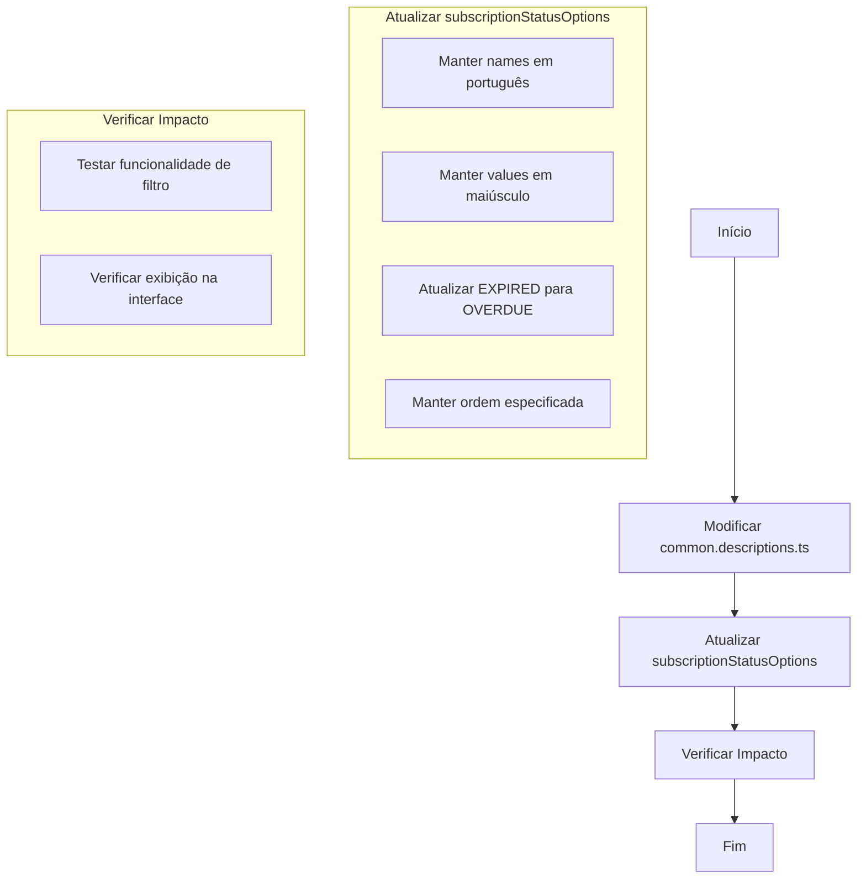

# Plano de Atualização dos Status de Assinaturas

## Contexto
Necessidade de atualizar os status das assinaturas na rota "Obter Assinaturas" para melhorar a experiência do usuário e manter consistência com a API.

## Objetivo
Modificar a estrutura dos status de assinaturas para:
- Exibir os nomes em português para o usuário
- Manter os valores em maiúsculo para a API
- Atualizar o status EXPIRED para OVERDUE
- Manter uma ordem específica dos status

## Diagrama de Implementação



## Implementação Detalhada

### 1. Modificação do Arquivo
Arquivo: `common.descriptions.ts`

Nova estrutura do array `subscriptionStatusOptions`:
```typescript
export const subscriptionStatusOptions = [
  {
    name: 'Iniciada',
    value: 'STARTED',
  },
  {
    name: 'Inativa',
    value: 'INACTIVE',
  },
  {
    name: 'Ativa',
    value: 'ACTIVE',
  },
  {
    name: 'Atrasada',
    value: 'DELAYED',
  },
  {
    name: 'Cancelada pelo Administrador',
    value: 'CANCELLED_BY_ADMIN',
  },
  {
    name: 'Cancelada pelo Cliente',
    value: 'CANCELLED_BY_CUSTOMER',
  },
  {
    name: 'Cancelada pelo Vendedor',
    value: 'CANCELLED_BY_SELLER',
  },
  {
    name: 'Vencida',
    value: 'OVERDUE',
  },
];
```

### 2. Testes e Validação
- Verificar se os filtros continuam funcionando corretamente
- Confirmar que a interface exibe os textos em português como esperado
- Validar que as requisições para a API continuam usando os valores corretos em maiúsculo

### 3. Impactos
- Interface do usuário: Textos mais amigáveis em português
- API: Mantém compatibilidade com valores em maiúsculo
- Consistência: Ordem definida dos status para melhor organização

## Próximos Passos
1. Implementar as alterações no modo Code
2. Realizar testes de funcionalidade
3. Validar a exibição na interface
4. Confirmar o funcionamento correto dos filtros
