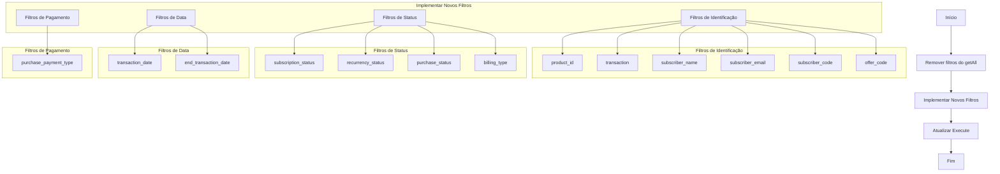

# Plano de Implementação: Filtros de Transações de Assinatura

## Contexto
O endpoint de Transações de Assinatura está atualmente usando os mesmos filtros do endpoint Obter Assinaturas, o que não é apropriado pois cada endpoint tem seus próprios parâmetros específicos conforme a documentação da API Hotmart.

## Objetivo
Implementar os filtros específicos para o endpoint de Transações de Assinatura, seguindo exatamente a documentação da API Hotmart.

## Diagrama de Implementação



## Implementação Detalhada

### 1. Definição das Constantes

```typescript
// Tipos de Cobrança
export const billingTypeOptions = [
    { name: 'Assinatura', value: 'SUBSCRIPTION' },
    { name: 'Parcelamento Inteligente Installment', value: 'SMART_INSTALLMENT' },
    { name: 'Recuperação Inteligente', value: 'SMART_RECOVERY' },
];

// Status de Recorrência
export const recurrencyStatusOptions = [
    { name: 'Pago', value: 'PAID' },
    { name: 'Não Pago', value: 'NOT_PAID' },
    { name: 'Contestado', value: 'CLAIMED' },
    { name: 'Reembolsado', value: 'REFUNDED' },
    { name: 'Chargeback', value: 'CHARGEBACK' },
];

// Tipos de Pagamento
export const paymentTypeOptions = [
    { name: 'Boleto', value: 'BILLET' },
    { name: 'Pagamento à Vista', value: 'CASH_PAYMENT' },
    { name: 'Cartão de Crédito', value: 'CREDIT_CARD' },
    { name: 'Transferência Bancária', value: 'DIRECT_BANK_TRANSFER' },
    { name: 'Débito', value: 'DIRECT_DEBIT' },
    { name: 'Boleto Financiado', value: 'FINANCED_BILLET' },
    { name: 'Parcelamento Financiado', value: 'FINANCED_INSTALLMENT' },
    { name: 'Google Pay', value: 'GOOGLE_PAY' },
    { name: 'Hotcard', value: 'HOTCARD' },
    { name: 'Híbrido', value: 'HYBRID' },
    { name: 'Transferência Manual', value: 'MANUAL_TRANSFER' },
    { name: 'PayPal', value: 'PAYPAL' },
    { name: 'PayPal Internacional', value: 'PAYPAL_INTERNACIONAL' },
    { name: 'PicPay', value: 'PICPAY' },
    { name: 'PIX', value: 'PIX' },
    { name: 'Samsung Pay', value: 'SAMSUNG_PAY' },
    { name: 'Wallet', value: 'WALLET' },
];
```

### 2. Implementação dos Filtros

```typescript
export const description: INodeProperties[] = [
    // ... outros parâmetros básicos ...
    {
        displayName: 'Filtros',
        name: 'filters',
        type: 'collection',
        placeholder: 'Adicionar Filtro',
        default: {},
        options: [
            {
                displayName: 'ID do Produto',
                name: 'product_id',
                type: 'string',
                default: '',
                description: 'Identificador único (ID) do produto vendido (número de 7 dígitos)',
            },
            {
                displayName: 'Código da Transação',
                name: 'transaction',
                type: 'string',
                default: '',
                description: 'Código único de referência para uma transação',
            },
            {
                displayName: 'Nome do Assinante',
                name: 'subscriber_name',
                type: 'string',
                default: '',
                description: 'Nome do comprador envolvido na transação',
            },
            {
                displayName: 'Email do Assinante',
                name: 'subscriber_email',
                type: 'string',
                default: '',
                description: 'Email do comprador envolvido na transação',
            },
            {
                displayName: 'Tipo de Cobrança',
                name: 'billing_type',
                type: 'options',
                options: billingTypeOptions,
                default: '',
                description: 'Tipo da cobrança',
            },
            {
                displayName: 'Status da Assinatura',
                name: 'subscription_status',
                type: 'options',
                options: subscriptionStatusOptions,
                default: '',
                description: 'Estado atual da assinatura',
            },
            {
                displayName: 'Status da Recorrência',
                name: 'recurrency_status',
                type: 'options',
                options: recurrencyStatusOptions,
                default: '',
                description: 'Situação do pagamento da recorrência',
            },
            {
                displayName: 'Status da Compra',
                name: 'purchase_status',
                type: 'string',
                default: '',
                description: 'Situação da transação de compra',
            },
            {
                displayName: 'Data Inicial da Transação',
                name: 'transaction_date',
                type: 'dateTime',
                default: '',
                description: 'Data inicial do filtro',
            },
            {
                displayName: 'Data Final da Transação',
                name: 'end_transaction_date',
                type: 'dateTime',
                default: '',
                description: 'Data final do filtro',
            },
            {
                displayName: 'Código da Oferta',
                name: 'offer_code',
                type: 'string',
                default: '',
                description: 'Chave de oferta (identificador da assinatura/plano)',
            },
            {
                displayName: 'Tipo de Pagamento',
                name: 'purchase_payment_type',
                type: 'options',
                options: paymentTypeOptions,
                default: '',
                description: 'Tipo de pagamento utilizado',
            },
            {
                displayName: 'Código do Assinante',
                name: 'subscriber_code',
                type: 'string',
                default: '',
                description: 'Identificador único do assinante',
            },
        ],
    },
];
```

### 3. Atualização do Execute

O método execute precisará ser atualizado para:
1. Remover a lógica de filtros do getAll
2. Implementar o processamento dos novos filtros
3. Converter datas para timestamp em milissegundos
4. Manter a paginação funcionando corretamente

## Observações Importantes

1. Os dados podem ter defasagem de até 24h
2. Por padrão, retorna dados dos últimos 30 dias
3. Para customizar o período, usar transaction_date e end_transaction_date
4. Manter compatibilidade com a paginação existente

## Próximos Passos

1. Criar arquivo com as constantes dos filtros
2. Atualizar getTransactions.operation.ts
3. Testar cada tipo de filtro
4. Verificar logs da API para garantir que os parâmetros estão sendo enviados corretamente
