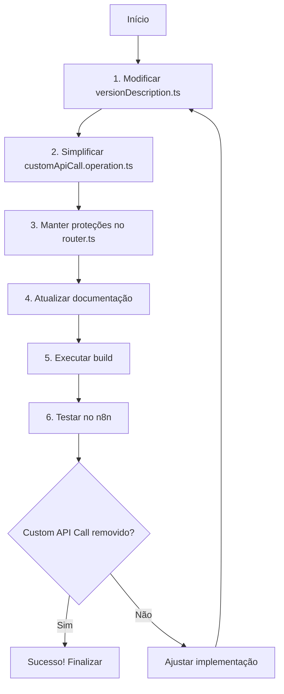

# Plano de Implementação: Remoção de Custom API Call nos Nós Hotmart

## Contexto e Problema

Os nós Hotmart na plataforma n8n estão exibindo a opção "Custom API Call" na interface do usuário, que não é desejada para esta integração. Nossa análise inicial tentou tratar o problema através de proteções no router.ts e uma implementação vazia em customApiCall.operation.ts.

Uma nova pesquisa revelou uma solução mais elegante que explora o mecanismo interno do n8n para prevenir completamente a injeção da opção "Custom API Call" na interface.

## Nova Abordagem Descoberta

A documentação encontrada revela que o n8n injeta automaticamente "Custom API Call" apenas em nós considerados "versão mais recente". Um nó é considerado "versão mais recente" quando:

```javascript
node.defaultVersion === undefined || node.defaultVersion === node.version
```

Ao criar uma discrepância intencional entre os valores de `version` e `defaultVersion`, podemos evitar que o n8n injete a opção "Custom API Call" na interface do nó.

## Plano de Implementação



### 1. Modificar versionDescription.ts

Alterar o arquivo `versionDescription.ts` para criar uma discrepância entre `version` e `defaultVersion`:

```typescript
export const versionDescription: INodeTypeDescription = {
    displayName: 'Hotmart',
    name: 'hotmart',
    icon: 'file:icons/hotmart.svg',
    group: ['transform'],
    // Criando discrepância para prevenir injeção de Custom API Call
    version: [1, 2],  // Array de versões em vez de número único
    defaultVersion: 1, // Mantido como número único
    // ... resto do código existente
};
```

### 2. Simplificar customApiCall.operation.ts

Manter uma versão simplificada do arquivo como backup:

```typescript
import type { IExecuteFunctions, INodeExecutionData } from 'n8n-workflow';

/**
 * NOTA: Este arquivo existe apenas como backup.
 * A opção "Custom API Call" não deve aparecer na interface devido à 
 * configuração de discrepância entre version e defaultVersion no versionDescription.ts
 */

// Descrição vazia para minimizar presença na interface
export const description = [];

// Função vazia como backup
export async function execute(
    this: IExecuteFunctions,
    items: INodeExecutionData[],
): Promise<INodeExecutionData[][]> {
    return [[]];
}
```

### 3. Manter Proteções no router.ts

Manter proteções básicas no router para maior segurança:

```typescript
// Detectar Custom API Call (qualquer variação)
if (
    resource === 'customApiCall' || 
    resource.toLowerCase().includes('custom api call') ||
    operation === '__CUSTOM_API_CALL__' ||
    operation.toLowerCase().includes('custom api call')
) {
    // Retorna array vazio sem executar nada
    return [[]];
}
```

### 4. Atualizar Documentação

Adicionar comentários explicativos nos arquivos relevantes para documentar a abordagem:

```typescript
/**
 * IMPORTANTE: Prevenção da injeção de "Custom API Call"
 * 
 * O n8n injeta automaticamente a opção "Custom API Call" em nós considerados
 * "versão mais recente", definidos por:
 * node.defaultVersion === undefined || node.defaultVersion === node.version
 * 
 * Para prevenir esta injeção, criamos intencionalmente uma discrepância entre
 * version e defaultVersion. Usamos version: [1, 2] e defaultVersion: 1
 * para evitar que o nó seja considerado "versão mais recente".
 * 
 * Esta abordagem explora um detalhe de implementação interna do n8n e pode
 * precisar ser revisitada após atualizações futuras da plataforma.
 */
```

### 5. Executar Build

Executar o script de build para aplicar as alterações:

```bash
./build-and-install.sh
```

### 6. Testar no n8n

Verificar se a opção "Custom API Call" não aparece mais na interface do nó Hotmart.

## Considerações Importantes

1. **Limitação**: Esta solução baseia-se em detalhes de implementação internos do n8n que não são documentados oficialmente.

2. **Manutenção**: Após atualizações futuras do n8n, é recomendável verificar se o comportamento permanece consistente.

3. **Semântica de Versão**: A utilização de `version: [1, 2]` tem significado semântico real, indicando que este nó suporta múltiplas versões da API (1 e 2), com a versão 1 como padrão.

4. **Backup**: As proteções no router.ts servem como camada adicional de segurança caso a implementação interna do n8n mude.

## Próximos Passos

1. Implementar as mudanças conforme plano
2. Testar exaustivamente na interface do n8n
3. Documentar a solução para referência futura
4. Monitorar o comportamento após atualizações do n8n
