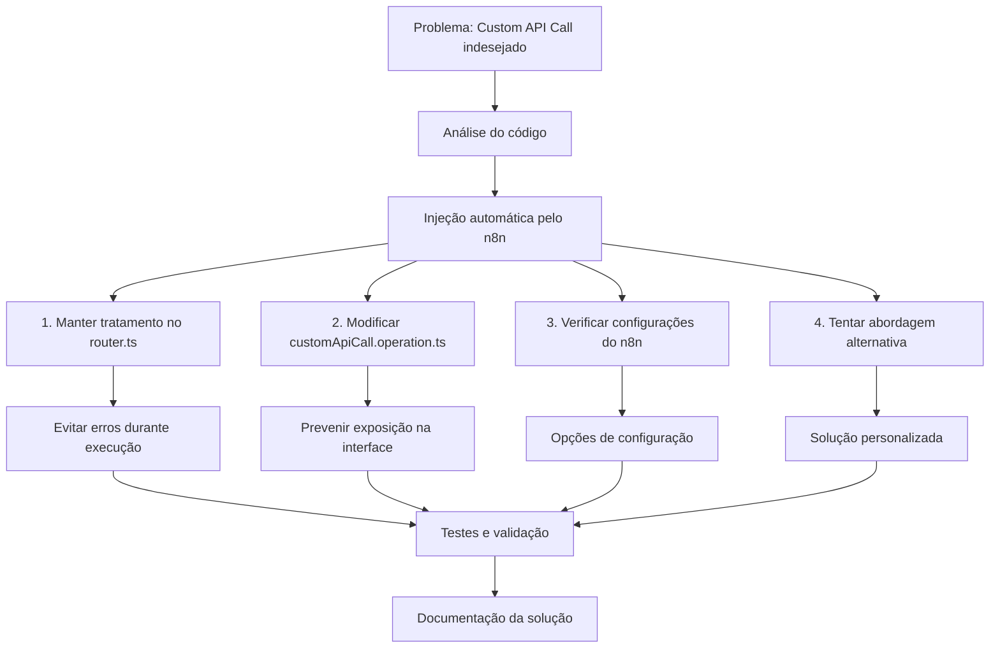

# Plano para Remoção de Custom API Call dos Nós Hotmart

## Contexto do Problema

O n8n está injetando automaticamente a opção "Custom API Call" na interface do nó Hotmart, tanto como recurso quanto como operação. Isso não é desejado e queremos remover todas as referências a essa funcionalidade.

## Objetivo

Desativar completamente a funcionalidade de Custom API Call nos nós Hotmart, sem afetar o funcionamento normal dos recursos reais da API Hotmart.

## Análise da Situação Atual

- O arquivo `router.ts` já possui tratamento para quando "customApiCall" é selecionado como recurso ou quando "__CUSTOM_API_CALL__" é selecionado como operação
- Existe um arquivo `customApiCall.operation.ts` com uma descrição vazia e uma função execute que retorna um array vazio
- Não há menção a Custom API Call no `versionDescription.ts`, indicando que é injetado automaticamente pelo n8n

## Plano de Ação

### Etapas de Implementação

1. **Manter o tratamento no router.ts:**
   - Garantir que o código atual trata corretamente quando Custom API Call é selecionado
   - Assegurar que o router retorne um array vazio nesses casos para evitar erros

2. **Refinar customApiCall.operation.ts:**
   - Manter a descrição como um array vazio para não adicionar nada à interface
   - Adicionar comentários explicativos sobre a função do arquivo

3. **Investigar opções do n8n:**
   - Verificar na documentação do n8n se existe alguma configuração que permita desativar a injeção automática do Custom API Call
   - Implementar essa configuração se for encontrada

4. **Abordagem alternativa:**
   - Se necessário, tentar sobrescrever o comportamento padrão do n8n
   - Esta é uma solução mais arriscada, mas pode ser eficaz se as anteriores não funcionarem

5. **Testes:**
   - Testar exaustivamente as modificações para garantir que:
     - Custom API Call não funciona quando selecionado
     - Não há erros ou logs de erro
     - As funcionalidades normais da API Hotmart continuam funcionando corretamente

6. **Documentação:**
   - Documentar a solução implementada
   - Explicar a limitação (não podemos remover completamente da interface)
   - Detalhar o comportamento esperado para o time

## Considerações Adicionais

- Esta solução foca em desativar a funcionalidade, não necessariamente em remover completamente a opção da interface (que parece ser controlada internamente pelo n8n)
- Futuras atualizações do n8n podem afetar esta implementação, então é importante documentar bem a solução

## Próximos Passos

1. Implementar o plano acima
2. Validar a solução com testes
3. Documentar para referência futura
