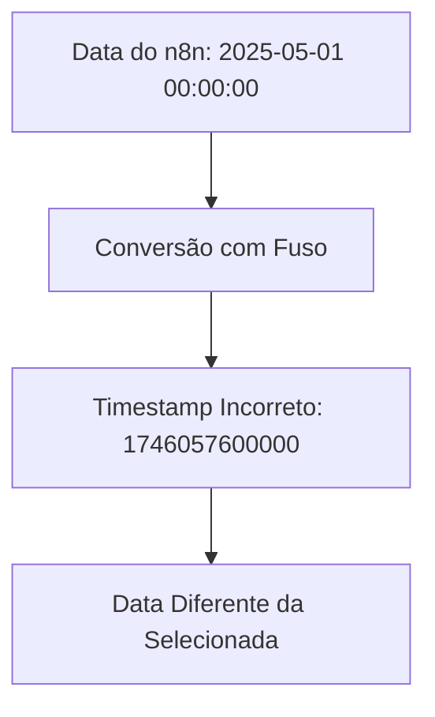
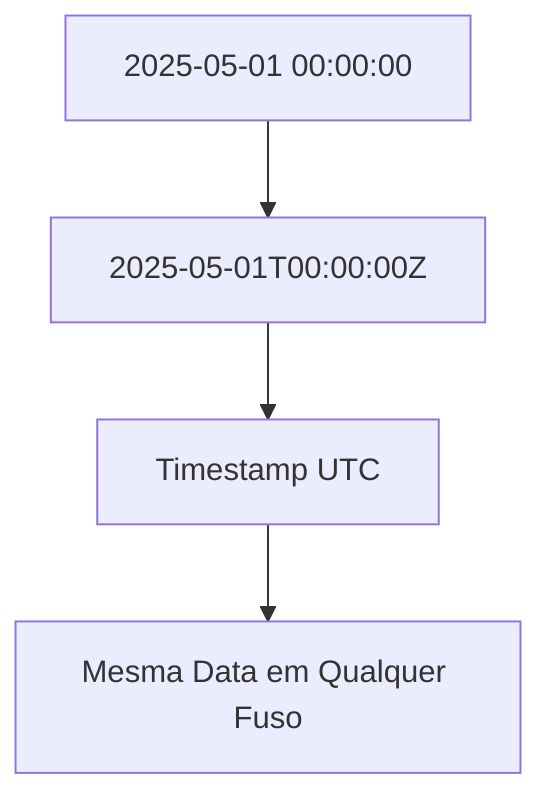

# Plano de Melhoria no Tratamento de Datas

## 1. Problema Identificado


## 2. Solução Proposta

### 2.1 Nova Função de Conversão
```typescript
const convertToTimestamp = (date: string | number): number | undefined => {
    // Se já for timestamp, retorna direto
    if (typeof date === 'number') return date;

    if (typeof date === 'string') {
        // Se for string numérica, converte para número
        if (/^\d+$/.test(date)) return parseInt(date, 10);

        // Formato do n8n: "2025-05-01 00:00:00"
        // Força UTC adicionando Z no final
        const normalized = date.replace(' ', 'T') + 'Z';
        const parsed = new Date(normalized);

        if (!isNaN(parsed.getTime())) {
            return parsed.getTime();
        }
    }

    return undefined;
};
```

### 2.2 Exemplo de Conversão


## 3. Arquivos a Modificar
1. nodes/Hotmart/v1/actions/subscription/getAll.operation.ts
2. nodes/Hotmart/v1/actions/subscription/getSummary.operation.ts

## 4. Campos Afetados
Todos os campos de data:
- accession_date
- end_accession_date
- cancelation_date
- end_cancelation_date
- date_next_charge
- end_date_next_charge

## 5. Validações
- Testar com data "2025-05-01 00:00:00"
- Verificar se o timestamp gerado mantém a data exata
- Confirmar que a data não é afetada pelo fuso horário local
- Garantir que a API da Hotmart recebe o timestamp correto

Você gostaria de fazer algum ajuste neste plano antes de prosseguirmos com a implementação?
